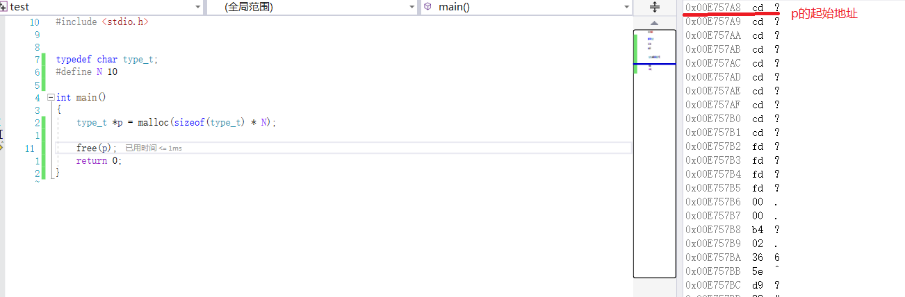
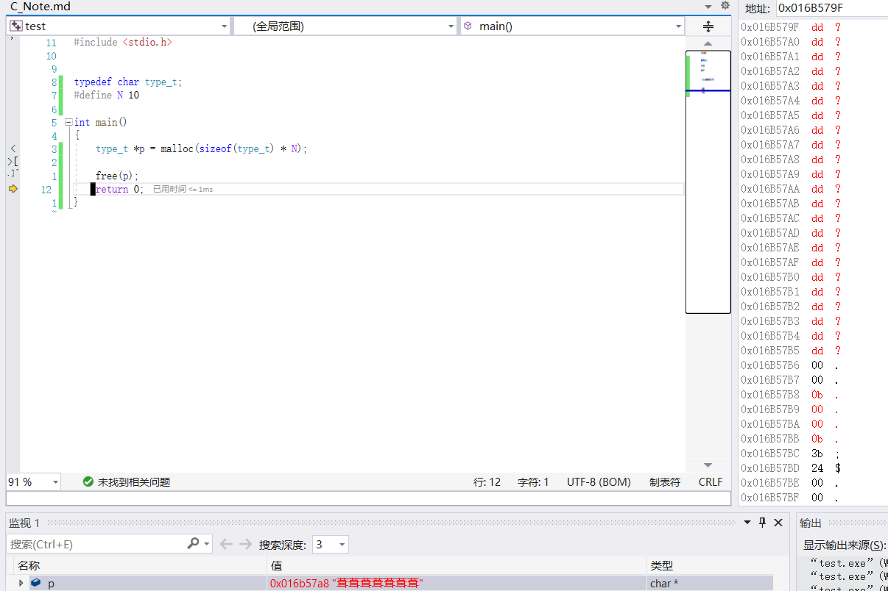



多维数组的物理结构
int a[3][4] = { 0,1,2,3,4,5,6,7,8,9,10,11 };
for (int i = 0; i < 3; i++) {
	for (int j = 0; j < 4; j++) {
		printf("a[%d][%d] : %p\n", i, j, &a[i][j]);
	}
}
在C语言中,多维数组都是一维抽象而成的,实际就是连续的多个一维数组.记得这一点,将指针和数组都化作一维来看待,解决这类问题就会简单很多.

证明数组a和&a不同
int a[10] = {0};
a是数组首元素地址,&a是数组的地址

int (*p)[10] = a;  //间接级别不同
int (*p)[10] = &a; //符合

数组与指针的差别证明
int main()
{
	int a[4] = { 1,2,3,4 };
	int* p = &a + 1;
	printf("%d \n", p[-1]); //指针才有的用法: p[-1] == *(p-1)
	return 0;
}

什么时候数组名表示整个数组?
1.sizeof(数组名) //sizeof括号内不能再有其他符号
2.&数组名
只有这两种情况才表示整个数组,其他情况数组名都表示数组的首元素地址,a[0]表示数组首元素(内容)
其他情况都会发生降维,降维成指针.

数组训练
int a[3][4] = { 0,1,2,3,4,5,6,7,8,9,10,11 };
printf("%d\n", sizeof(a)); //二维数组
printf("%d\n", sizeof(a[0][0])); //二维数组第一个元素的第一个元素,即第一个一维数组的第一个元素
printf("%d\n", sizeof(a[0]));    //二维数组的第一个元素,是第一个一维数组,没有降维,16
printf("%d\n", sizeof(a[0] + 1));  //二维数组的第一个元素+1,即降维成第一个一维数组的首元素地址+1.是第一个一维数组的第二个元素的地址.
printf("%d\n", sizeof(*(a[0]+1)));  //第一个一维数组的第二个元素
printf("%d\n", sizeof(a + 1));  //降维成二维数组第一个元素的地址+1,即二维数组第二个元素的地址
printf("%d\n", sizeof(*(a+1)));     //二维数组的第二个元素,即第二个一维数组,没有发生降维,16
printf("%d\n", sizeof(&a[0] + 1));    //理解1:二维数组的第一个元素即第一个一维数组取地址,需要一维数组降维成指针,才能进行取地址,数组降维成指针后,就是数组的首元素地址,首元素地址再取地址就成了一维数组. (编译器不支持再升维成数组)
										//理解2:二维数组的第一个元素取地址,二维数组就已经降维成二维数组的首元素地址,元素取地址,则指针对应的类型是二维数组元素的类型,+1就是加一个元素的大小.即得到二维数组的第二个元素的地址. (这种理解更符合编译器行为)
printf("%d\n", sizeof(*(&a[0]+1))); //什么含义？
printf("%d\n", sizeof(*a));   //什么含义？
printf("%d\n", sizeof(a[3])); //什么含义？

理解指针与数组的题目
int a[5][5] = { 0 };
for (int i = 0; i < 25; i++)
{
	*(&**a + i) = i;
}
for (int i = 0; i < 25; i++)
{
	printf("%d ", *(&**a + i));
}
puts("");

int(*p)[4];  //定义一个类型为int[4]的指针变量
p = (int(*)[4])a;  //强转只是为了让编译器不警告
printf("pa=%p, pb=%p\n", &a[4][2], &p[4][2]);  //请问结果分别是多少?
printf("%p,%d\n", &p[4][2] - &a[4][2], &p[4][2] - &a[4][2]);//指针做差结果是元素的个数,可正可负

//先将指针模拟数组多维访问的方式降维成一维的计算方式: p[4][2] = *(*(p + 4) + 2);
//然后将数组物理结构图展开
//p所指向的类型是int[4],因此步长是4个int
//a本身是数组,不需要降维
//编译器会查看元素是否是地址,或者说,默认指针计算就是把元素值当作地址.所以不用当心指针解引用后是指针还是数据的影响.

数组传参过程,函数形参中括号[]内的常数可以省略,因为数组最终会降维成指针,指针使用[]就没有数组这样的约束了

所有的数组,都可以看成一维数组.所有的数组传参,最终都会降维成一维数组
1.二维数组降维
void func(int(*p)[6],int size) //一维数组,数组元素类型为int[6][7][8]
{ }

int main()
{
	int a[5][6] = { 0 };
	func(a,5);
	return 0;
}

2.高维数组降维
void func(int(*p)[6][7][8],int size)  //一维数组,数组元素类型为int[6][7][8]
{ }

int main()
{
	int a[5][6][7][8] = { 0 };
	func(a,5);
	return 0;
}

验证: 只有第一个中括号能省略,即明确要求降维成一维指针
void func(int p[][6][7][8],int size)  
{ }

int main()
{
	int a[5][6][7][8] = { 0 };
	func(a,5);
	return 0;
}
如果省略了指针第一个[]内的数值,则指针的类型就会不明确

//为什么要降维? 不降维就要拷贝整个数组,成本开销很大,降维成指针后只需要拷贝地址

函数的地址
void func()
{ }

int main()
{
	printf("%p\n", func); //常用
	printf("%p\n", &func);
	return 0;
}
C语言中函数名和&函数名完全等价,都代表函数的地址
函数在程序中不可写入,只需要关心它的起始位置在哪里

要保存函数的地址,就需要使用函数指针变量
函数指针可以通过圆括号()来调用指向的函数.例如p();

内存管理

栈上开辟空间一定要明确知道空间大小,因为要压栈
动态内存,满足内存申请的灵活性

临时变量为什么有临时性,原因是栈空间本身就具有临时性
全局数据区,随着整个程序的运行而一直存在; 保存在全局数据区的变量的声明周期都随进程

我们能检查指针的合法性吗?
不能;指针如果有具体的指向(包括野指针),对应的合法性我们无法验证,因为指针指向什么用户无法得知;
一般的合法性检查指的是空指针问题,传入一个错误的非空指针(野指针)是无法检查出来的,只能从编程规范去控制

指针在遍历时,越界不一定会报

什么样的程序最怕内存泄漏? 常驻进程:常驻内存的程序,例如操作系统,杀毒软件,服务器等

运行起来的程序,已经和编译器没有关系了

malloc返回给用户的只有申请内存的起始地址,那free是如何准确释放动态内存申请的空间?

继续:从内存查看malloc和free的行为

malloc,查看内存,内存值为cd的是开辟给用户的空间

(VS中malloc分配的空间会初始化成十六进制cd)

再看free,free后可以发现释放的空间不止10个,说明malloc分配的空间不止10个

申请多出来的空间,是编译器用来记录申请空间的详细数据.提供给free,能够实现准确释放申请的内存,一般情况,这些数据的大小是固定的
记录这些信息的数据,称为cookie.属于内存级的cookie

有cookie存在,会有一个内存申请多大问题.申请空间越大好还是越小好?    
从利用率来说,申请大空间好,因为cookie是固定大小的,如果申请的空间过小,则可利用空间占有总申请空间比率就会小.
如果想申请小空间,则在栈上申请更高效.
因此,栈和堆在哪里申请的问题就可以通过这个思考来决定.

内存验证
