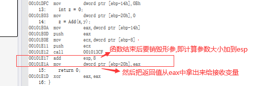

多维数组的物理结构
int a[3][4] = { 0,1,2,3,4,5,6,7,8,9,10,11 };
for (int i = 0; i < 3; i++) {
	for (int j = 0; j < 4; j++) {
		printf("a[%d][%d] : %p\n", i, j, &a[i][j]);
	}
}
在C语言中,多维数组都是一维抽象而成的,实际就是连续的多个一维数组.记得这一点,将指针和数组都化作一维来看待,解决这类问题就会简单很多.

证明数组a和&a不同
int a[10] = {0};
a是数组首元素地址,&a是数组的地址

int (*p)[10] = a;  //间接级别不同
int (*p)[10] = &a; //符合


数组与指针的差别证明
int main()
{
	int a[4] = { 1,2,3,4 };
	int* p = &a + 1;
	printf("%d \n", p[-1]); //指针才有的用法: p[-1] == *(p-1)
	return 0;
}

什么时候数组名表示整个数组?
1.sizeof(数组名) //sizeof括号内不能再有其他符号
2.&数组名
只有这两种情况才表示整个数组,其他情况数组名都表示数组的首元素地址,a[0]表示数组首元素(内容)
其他情况都会发生降维,降维成指针.


数组训练
int a[3][4] = { 0,1,2,3,4,5,6,7,8,9,10,11 };
printf("%d\n", sizeof(a)); //二维数组
printf("%d\n", sizeof(a[0][0])); //二维数组第一个元素的第一个元素,即第一个一维数组的第一个元素
printf("%d\n", sizeof(a[0]));    //二维数组的第一个元素,是第一个一维数组,没有降维,16
printf("%d\n", sizeof(a[0] + 1));  //二维数组的第一个元素+1,即降维成第一个一维数组的首元素地址+1.是第一个一维数组的第二个元素的地址.
printf("%d\n", sizeof(*(a[0]+1)));  //第一个一维数组的第二个元素
printf("%d\n", sizeof(a + 1));  //降维成二维数组第一个元素的地址+1,即二维数组第二个元素的地址
printf("%d\n", sizeof(*(a+1)));     //二维数组的第二个元素,即第二个一维数组,没有发生降维,16
printf("%d\n", sizeof(&a[0] + 1));    //理解1:二维数组的第一个元素即第一个一维数组取地址,需要一维数组降维成指针,才能进行取地址,数组降维成指针后,就是数组的首元素地址,首元素地址再取地址就成了一维数组. (编译器不支持再升维成数组)
										//理解2:二维数组的第一个元素取地址,二维数组就已经降维成二维数组的首元素地址,元素取地址,则指针对应的类型是二维数组元素的类型,+1就是加一个元素的大小.即得到二维数组的第二个元素的地址. (这种理解更符合编译器行为)
printf("%d\n", sizeof(*(&a[0]+1))); //什么含义？
printf("%d\n", sizeof(*a));   //什么含义？
printf("%d\n", sizeof(a[3])); //什么含义？


理解指针与数组的题目
int a[5][5] = { 0 };
for (int i = 0; i < 25; i++)
{
	*(&**a + i) = i;
}
for (int i = 0; i < 25; i++)
{
	printf("%d ", *(&**a + i));
}
puts("");

int(*p)[4];  //定义一个类型为int[4]的指针变量
p = (int(*)[4])a;  //强转只是为了让编译器不警告
printf("pa=%p, pb=%p\n", &a[4][2], &p[4][2]);  //请问结果分别是多少?
printf("%p,%d\n", &p[4][2] - &a[4][2], &p[4][2] - &a[4][2]);//指针做差结果是元素的个数,可正可负

//先将指针模拟数组多维访问的方式降维成一维的计算方式: p[4][2] = *(*(p + 4) + 2);
//然后将数组物理结构图展开
//p所指向的类型是int[4],因此步长是4个int
//a本身是数组,不需要降维
//编译器会查看元素是否是地址,或者说,默认指针计算就是把元素值当作地址.所以不用当心指针解引用后是指针还是数据的影响.


数组传参过程,函数形参中括号[]内的常数可以省略,因为数组最终会降维成指针,指针使用[]就没有数组这样的约束了

所有的数组,都可以看成一维数组.所有的数组传参,最终都会降维成一维数组
1.二维数组降维
void func(int(*p)[6],int size) //一维数组,数组元素类型为int[6][7][8]
{ }

int main()
{
	int a[5][6] = { 0 };
	func(a,5);
	return 0;
}

2.高维数组降维
void func(int(*p)[6][7][8],int size)  //一维数组,数组元素类型为int[6][7][8]
{ }

int main()
{
	int a[5][6][7][8] = { 0 };
	func(a,5);
	return 0;
}

验证: 只有第一个中括号能省略,即明确要求降维成一维指针
void func(int p[][6][7][8],int size)  
{ }

int main()
{
	int a[5][6][7][8] = { 0 };
	func(a,5);
	return 0;
}
如果省略了指针第一个[]内的数值,则指针的类型就会不明确


//为什么要降维? 不降维就要拷贝整个数组,成本开销很大,降维成指针后只需要拷贝地址


函数的地址
void func()
{ }

int main()
{
	printf("%p\n", func); //常用
	printf("%p\n", &func);
	return 0;
}
C语言中函数名和&函数名完全等价,都代表函数的地址
函数在程序中不可写入,只需要关心它的起始位置在哪里

要保存函数的地址,就需要使用函数指针变量
函数指针可以通过圆括号()来调用指向的函数.例如p();


内存管理

栈上开辟空间一定要明确知道空间大小,因为要压栈
动态内存,满足内存申请的灵活性


临时变量为什么有临时性,原因是栈空间本身就具有临时性
全局数据区,随着整个程序的运行而一直存在; 保存在全局数据区的变量的声明周期都随进程

我们能检查指针的合法性吗?
不能;指针如果有具体的指向(包括野指针),对应的合法性我们无法验证,因为指针指向什么用户无法得知;
一般的合法性检查指的是空指针问题,传入一个错误的非空指针(野指针)是无法检查出来的,只能从编程规范去控制
规范约定野指针置空,便于进行合法性检查.如果不置空,就是不遵循编码规范

指针在遍历时,越界不一定会报

什么样的程序最怕内存泄漏? 常驻进程:常驻内存的程序,例如操作系统,杀毒软件,服务器等

运行起来的程序,已经和编译器没有关系了


malloc返回给用户的只有申请内存的起始地址,那free是如何准确释放动态内存申请的空间?

继续:从内存查看malloc和free的行为

malloc,查看内存,内存值为cd的是开辟给用户的空间

(VS中malloc分配的空间会初始化成十六进制cd)


再看free,free后可以发现释放的空间不止10个,说明malloc分配的空间不止10个


申请多出来的空间,是编译器用来记录申请空间的详细数据.提供给free,能够实现准确释放申请的内存,一般情况,这些数据的大小是固定的
记录这些信息的数据,称为cookie.属于内存级的cookie

有cookie存在,会有一个内存申请多大问题.申请空间越大好还是越小好?    
从利用率来说,申请大空间好,因为cookie是固定大小的,如果申请的空间过小,则可利用空间占有总申请空间比率就会小.
如果想申请小空间,则在栈上申请更高效.
因此,栈和堆在哪里申请的问题就可以通过这个思考来决定.


内存验证
```
#include<stdio.h>
#include<stdlib.h>

void fun1()
{

}

void fun2()
{

}

int g_val1;
int g_val2;

int g_val3 = 0;
int g_val4 = 0;

int main()     
{             

  int a1 = 0;
  int a2 = 0;
  static int a3 = 0;

  puts("栈区增长方向验证:");
  printf("stack Area: &a1=%p\n",&a1);
  printf("stack Area: &a2=%p\n",&a2);

  puts("堆区增长方向验证:");
  int *arr1 = (int*)malloc(sizeof(int)*3);
  int *arr2 = (int*)malloc(sizeof(int)*3);
  printf("heap Area: arr1=%p\n",arr1);
  printf("heap Area: arr2=%p\n",arr2);

  puts("未初始化数据区:");
  printf("uninitialized data Area: %p\n",&g_val1);
  printf("uninitialized data Area: %p\n",&g_val2);
  
  puts("已初始化数据区:");
  printf("initialized data Area: %p\n",&g_val3);
  printf("initialized data Area: %p\n",&g_val4);
  printf("static data Area: %p\n",&a3);

  puts("常量区:");
  const char *str = "hello world!";
  printf("constant Area: %p\n",str);

  puts("代码区:");
  printf("main addr: %p\n",main);
  printf("code Area: fun1=%p\n",fun1);
  printf("code Area: fun2=%p\n",fun2);
  //在前面的先注册

  return 0;    
}   

```


函数的规范
在比较长的代码结尾处,加上注释
//end of if 
//end of for

长表达式要在低优先级操作符处划分新行,操作符放在新行之首(以便突出操作符).

原则上尽量少使用全局变量,因为全局变量的生命周期太长,容易出错,也会长时间占用空间.其次,在多线程下会有线程安全问题,容易出错

参数命名:
新旧值类型的一般遵行从右向左原则,像赋值符号一样,如字符串拷贝函数`str_copy(char*dest,const char*src)`;_

函数功能要单一,不要设计多用途的函数.微软的Win32API就是典型,其函数往往因为参数不一样而功能不一,初学很容易迷惑

相同的输入应当产生相同的输出.尽量避免函数带有"记忆"功能,这样的函数的行为不好预测,行为取决于某种"记忆".
"记忆"功能:如static修饰的局部变量,是函数的"记忆"存储器.

避免函数有太多的参数,具体取决于业务,能简则简.如果参数过多,在使用时容易将参数类型或顺序搞错.
例如微软的WIN32API,其函数的参数往往有七八个甚至十余个

类型和数目不确定的参数,要深思熟虑,因为这样的函数没有严格的类型安全检查.如printf.


<br>
<br>
<br>

# 函数栈帧
## 认识相关寄存器
> eax：通用寄存器，保留临时数据，常用于返回值 
> ecx：通用寄存器，保留临时数据，常用于返回值 
> ebx：通用寄存器，保留临时数据
> ebp：栈底寄存器
> esp：栈顶寄存器 
> eip：指令寄存器，保存当前指令的下一条指令的地址

## 认识相关汇编命令 
> mov：数据转移指令 
> push：数据入栈，同时esp栈顶寄存器也要发生改变 
> pop：数据弹出至指定位置，同时esp栈顶寄存器也要发生改变 
> sub：减法命令
> add：加法命令
> call：函数调用，1. 压入返回地址 2. 转入目标函数 
> jump：通过修改eip，转入目标函数，进行调用 
> ret：恢复返回地址，压入eip，类似pop eip命令


## 查看调用堆栈
通过下面代码举例:  
```
#include <stdio.h>


int Add(int a, int b)
{
    return a+b;
}

int main()
{
    int x = 0xA;
    int y = 0xB;
    int z = 0;
    z = Add(x,y);
    return 0;
}
```
F10进入调试,走到main函数快结束位置,当前的调用堆栈:


(如果是vs2013,则能够进入到调用main函数的源代码中,vs2019下执行完return后直接结束了,有知道怎么解决的朋友可以评论区分享.)

在调用堆栈中右键勾选显示外部代码,可以看到更详细的调用堆栈


打开后能发现更多的调用堆栈,这可以简单说明main函数也是被调用的.


定义变量时的内存变化和汇编代码


看函数调用过程的汇编代码


ebp-14是变量y的地址,ebp-8是x的地址,即先压入y,再压入x,然后再调用函数

**说明:**

1.形参实例化的顺序从右向左

2.函数的形参在函数调用前就形成

3.给没有形参的参数传参也是会定义的(补充验证)


函数形成栈帧:


从汇编上看,函数自己的栈不包括形参


释放栈帧:


> 因此,调用函数是有成本的，成本体现在时间和空间上，本质是形成和释放栈帧有成本


最后的ret,恢复返回地址，压入eip，类似pop eip命令;即指令寄存器,恢复到主调函数要执行的下一条指令




最后,可以发现,形参变量是通过push和pop管理,那么它们的地址就是连续的.
根据这个原理,我们理论上也可以通过计算指针偏移量来修改形参的值,来实现一些功能....
现代编译器为了保证程序安全可能有各种安全手段,如栈随机化的技术,金丝雀栈保护机制,因此根据地址直接修改程序没有那么简单.

> 在进程中,堆栈地址是从高到低分配的.当执行一个函数的时候,将参数列表入栈,压入堆栈的高地址部分,然后入栈函数的返回地址,接着入栈函数的执行代码,这个入栈过程,堆栈地址不断递减,一些黑客就是在堆栈中修改函数返回地址,执行自己的代码来达到执行自己插入的代码段的目的.


# 可变参数列表

## 可变参数的原理

在函数栈帧的汇编分析中可知,函数形参在函数调用前定义,且定义顺序从右往左,依次压栈.

因为是可变参数,如果要我们使用,我们只要知道函数形参的第一个形参的起始地址,然后根据每个参数的类型,得到它们的内存空间布局就可以使用了. 

可变参数至少需要固定一个形参,否则会报错,为什么? 

原理是这样,但如果要我们手动去做,显然是一件非常麻烦的事情.

因此C语言提供了一套方案,提供了几个宏便于用户更方便地使用可变参数列表.

## C语言提供的可变参数方案

## stdarg.h

在stdarg.h文件中有如下几个宏定义：

```
#include <vadefs.h>

#define va_start _crt_va_start
#define va_arg _crt_va_arg
#define va_end _crt_va_end

#endif  /* _INC_STDARG */
```

其定义在vadefs.h中分别为：

```
#define _INTSIZEOF(n) ((sizeof(n)+sizeof(int)-1)&~(sizeof(int) - 1) ) 

#define va_start(ap,v) ( ap = (va_list)&v + _INTSIZEOF(v) ) //第一个可选参数地址 

#define va_arg(ap,t) ( *(t *)((ap += _INTSIZEOF(t)) - _INTSIZEOF(t)) ) //下一个参数地址 

#define va_end(ap) ( ap = (va_list)0 ) // 将指针置为无效
```


### va_list

用于定义可以访问可变参数部分的变量

```
va_list arg;
```

va_list是char*类型的指针,可以按一字节的方式进行字节级别的数据读取.

```
typedef char* va_list;
```


### va_start

它可以通过第一个参数来定位可变参数的位置,使arg指向可变参数部分


### va_arg

通过arg,和类型,返回对应的值


### va_end

arg使用完毕后,使arg指向NULL. 即收尾工作


看可变参数的内存布局和汇编代码,用十六进制作为参数容易看内存

看传char类型触发整型提升,movsx,带符号扩展(整型提升),并传送

​	可变参数列表传入参数是char,short,float等类型时,也会发生整型提升,因为也是要加载到寄存器中


> 在C语言中，可变参数函数设计上要求至少有一个固定参数的原因主要有以下几点：
>
> 1. **标示参数开始**：可变参数函数至少需要一个非可变参数作为“标记”，这是因为编译器需要知道从哪里开始解析可变参数列表。这个固定参数通常用于传递关于可变参数的信息，比如参数的数量或者某种类型的标识符。例如，在`printf`函数中，第一个固定参数（格式化字符串）就告诉函数接下来的可变参数应该怎样被解释和处理。
> 2. **获取参数信息**：通过这个固定的参数，可以在运行时决定如何访问和解析后面的可变参数。例如，通过分析格式化字符串，`printf`可以确定需要读取多少个参数以及它们的类型。
> 3. **定位参数地址**：在实现上，可变参数是通过栈传递的，第一个固定参数的地址可以帮助确定可变参数在栈上的起始位置。这样，通过指针算术，我们可以从这个已知位置开始访问后续的可变参数。
> 4. **类型安全与边界界定**：虽然C语言本身并不直接支持类型安全检查，但至少有一个固定参数可以作为编写安全、有效的可变参数处理逻辑的基础。这个参数可以辅助进行基本的参数验证，尽管更复杂的类型检查通常需要在函数内部手动实现。
>
> 简而言之，这个固定的参数不仅是逻辑上的需要，也是技术实现上的必要条件，它帮助程序正确地识别和处理随后的可变数量的参数。在实际应用中，通常会结合`<stdarg.h>`头文件中定义的宏（如`va_start`, `va_arg`, `va_end`等）来遍历和处理可变参数列表。


