## 符号

[TOC]

### 注释

C语言风格的注释: `/* 这是注释 */`  
C++风格的注释: `//这是注释`

#### 奇怪的注释

```
int main()
{
int /* */ i;                    //1.正确
char *s = "abcdefgh //hijklmn"; //2.正确：//是字符串的一部分
//Is it a\
valid comment?                  //3.正确  注释可以通过续行符续行
in/* */t j;                     //4.报错
system("pause");
return 0;
}
```

gcc4.8.5的语法检查:  
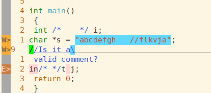  
为什么4是错的?  看预编译后的结果:  
执行预编译命令:`gcc -E test.c -o test.i`  

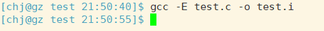

(发现预处理阶段gcc并没有报错,说明问题是出在编译后的)  

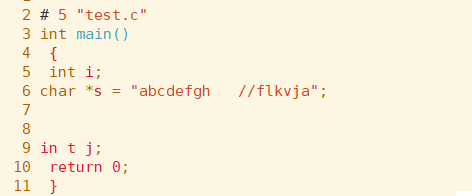  
可以发现 第9行 int中间多了空格,说明注释在预编译可能会被转化成空格.

而第5行的int i中间只有一个空格,说明注释是直接被删除或合并成一个空格.

**结论:注释在预编译后会替换成空格,具体替换方式由编译器决定**


#### C风格的注释无法嵌套

预编译:

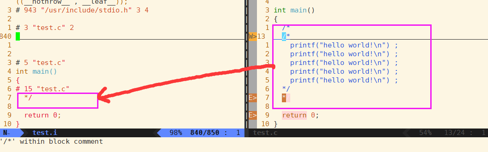


可以发现预编译后上面两个\\*没有了,下面还有一个\*\\.

原因: C语言把遇到的第一个/\*之后的数据都当作注释,直到遇到第一个/\*,因此嵌套在中间的/\*不会再被检查出来.且在预处理阶段会删除掉这些注释.所以嵌套的注释会留下一个\*.
C风格注释采用的是就近原则.如果要能嵌套,就得使用就远原则才足以容纳多个嵌套
至于为什么不选择像代码块这样的匹配规则,可能就是历史遗留问题了,有知道的朋友可以分享在评论区.

#### 一些特殊的注释

- 宏中间的注释

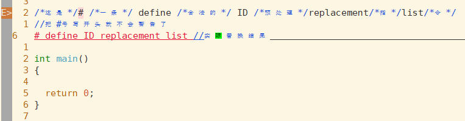

- 除号和\*号同时使用

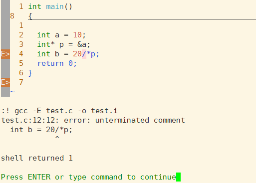

解决方法:

1.在/和\*后加上一个空格  `int b = 20/ *p`

2.用圆括号把(\*)括起来`int b = 20/(*p)` ,推荐这种方式,更为直观

#### 注释的规则建议

1. 注释应当准确、易懂，防止有二义性。错误的注释不但无益反而有害。

2. 边写代码边注释，修改代码的同时修改相应的注释，以保证注释与代码的一致性。不再有用的注释要即使删除。

3. 注释是对代码的的“提示”，而不是文档。程序中的注释应当简单明了，注释太多了会让人眼花缭乱。

4. 对于全局数据（全局变量、常量定义等）必须要加注释。

5. 注释的位置应与被描述的代码相邻，可以与语句在同一行，也可以在上行，但不可以放在下方。同一结构中不同域的注释要对齐。

6. 当代码比较长，特别是有多重嵌套时，应当在一些段落的结束处加注释，便于阅读。

7. 注释代码段时应注重“为何做（why) ",而不是怎么做”（how）“
   说明怎么做的注释一般停留在编程语言的层次，而不是为了说明问题。尽力阐述“怎么做”的注释一般没有告诉我们操作的意图，而指明“怎么做”的注释通常是冗余的。

8. 数值的单位一定要注释。如时、分、秒等单位。

9. 对变量的范围给出注释，尤其是参数。

10. 对一系列的数字编号给出注释，尤其在编写底层驱动程序的时候（比如引脚编号）。

11. 在复杂的函数中，在分支语句、循环语句结束之后需要适当的注释，方便区分各分支或循环体。（很多时候代码写长后，一个屏幕内看不到下面的代码，不知道哪个才是相应代码块匹配的花括号）
    
    

### 反斜杠`\`

#### 反斜杠有续行的作用，但要注意续行后不能添加空格

  如图，在续行符前加多个空格没有影响：

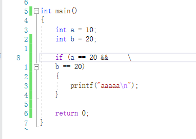

但续行符后不能加空格

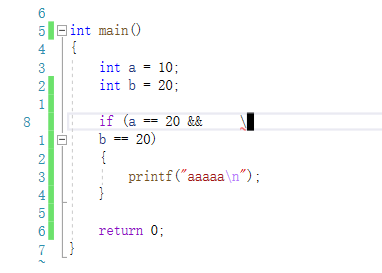

##### 回车也能起到换行的作用，那续行符的意义在哪？

续航符本身就有自描述性.这是续行符最大的意义,就是要明确告诉别人这里是换行的,没有二义性.如果使用回车,别人在阅读的时候有可能需要思考是不是故意换行的或者是不是不小心误敲了.

#### 反斜杠的转义功能

转义,即对某些字符进行反斜杠,可以使之拥有超过本身的功能,

转义有两种,一种是诸如`\n`,`\t`这样的转义字符,转义后具有本身字面值之外的特殊功能;另一种诸如`\"`,`\\`这种,本身字面值没有意义,而是其他功能,转义后具有字面值的意义.

转义的功能简单描述就是 (a. 字面转特殊  b. 特殊转字面)


### 单引号和双引号

基本概念:单引号内的是字符,双引号的是字符串


#### 字面值,字符串,字符,字符变量的大小

sizeof分别计算大小:

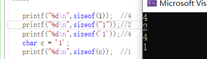

#### 为什么`sizeof'1'`的大小是4 ?

C99标准的规定,'a'这种单引号引起来的字符叫做整型字符常量(integer character constant),会被编译器看成整型.因此大小是4个字节

>  (注意:在C++中字符常量大小为1,不同平台/语言解释是不一样的.)

#### char类型一直在发生截断.

char类型基本上都是接收整型字符常量,而char类型只占一个字节大小,因此只能保留整型的一个字节(首字节),即截断.

#### 不允许定义空字符常量

单引号内至少要有一个字面值

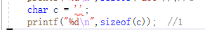

#### 单引号内一般是一个字符,还可以有多个字符

如下图,可以发现是没有警告的.

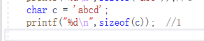

打印结果:

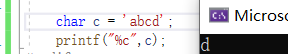

但是最多4个字符,多了会告警

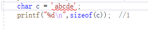

为什么能这样用呢? 也是上文所说的,字符常量被C语言当作整型来看待,分配了4个字节.

一个字符字面值就占一个字节,4个字符就刚好占了4个字节,整型分配的空间能够满足.

而char类型又是截断了整型的低地址字节位,因此只会输出最后一个字符字面值(小端).


### 短路

逻辑与`&&`和逻辑或`||`的左边条件不满足,则不需要再看后续条件的情况,就叫做短路.

```C
int show()
{
    printf("aaaaaaa");
    return 1;
}

int main()
{
   int flag = 0;
   scanf("%d",&flag);
   flag && show();  //使用短路实现的if语句效果
   //如果表达式左边为假,则表达式右边不再执行,这样的语句就称为短路.

   scanf("%d",&flag);
   flag || show();  //使用短路实现的if not语句

    return 0;
}
```


### 位运算

#### 位运算和逻辑运算区别

位运算是一位对应一位的对所有位逐一进行运算(逐比特位进行运算).逻辑运算是以计算表达式的真假为主进行运算.

#### 位运算的几点注意

1. 机器都是使用补码进行运算,遇到负数时不要混淆

2. `~(-1)`的结果是0,`~(0)的结果是-1`,按位取反所有位都要取反,不论是否有符号.

#### 异或的运算规则

1. 运算规则: 相同为假, 相异为真
   
   ```C
   0000 0000 ... 0100
   0000 0000 ... 0011
   ```

------------------

0000 0000 ... 0111
printf("%d\n",4^3); //结果:7

```

2. 任何数据和0异或,结果都是它本身
```C
printf("%d\n",1 ^ 0);  //结果:1
printf("%d\n",6 ^ 0);  //结果:6
printf("%d\n",7 ^ 0);  //结果:7
printf("%d\n",-1 ^ 0); //结果:-1
```

3. 异或运算支持交换律和结合律
   
   ```
   printf("%d\n",5 ^ 5 ^ 4);   //结果:4
   printf("%d\n",5 ^ 4 ^ 5);   //结果:4 => 交换律
   printf("%d\n",5 ^ (5 ^ 4)); //结果:4 => 结合律
   ```

4. 异或自己的结果是0 (消消乐)

#### 异或的经典问题:两数交换

问题:两个变量`int a = 10; int b = 20;`再不使用第三个变量的前提下,怎么讲两个数进行交换?

**方法一:加减法**

```
    a = a + b;  // ①
    b = a - b;  // ②
    a = a - b;  // ③
```

解析:  

(在计算机运算中,运算过程可以当作第三个变量,只是这个过程必须赋值才有意义,我们可以计算出各种组合的值用来匹配和验证)

1. ①是将a和b的值保存到a中.原理:a+b-b = a,只要b还在,a就不会丢失.(借助a当作第三个容器)
2. ②:验证发现新a-b = 旧a,赋值给b后就能实现b变成了旧a.
3. ③:a变量保存着旧a和旧b,新b保存旧a,于是新a-新b就等于旧b.

缺点: 加法可能会有比特位递增,如果发生溢出,则会发生截断,导致数据丢失.所以这种方法仅适用于一定范围的数据


**方法二:异或法**

```
    a = a ^ b; //①
    b = a ^ b; //②
    a = a ^ b; //③
一次记住它: 等号左边是aba,右边全是a^b
```

解析:(消消乐)

1. ①是a和b的值保存在a中.原理:`a^b^b=a`,只要b还在a就不会丢失.
2. ②: 新a=`10^20`,对b=`a^b=10^20^20`,利用结合律,先计算`20^20`,就可以得到a,然后再赋值给b,b变量就得到了旧a的值.
3. ③:有了旧a的值,交换律+消消乐把新a中旧a的值消掉,新a就可以得到旧b的值,完成交换.

相对于加减法的优点: 异或不会进位，不会出现比特位递增、溢出的问题

#### 位操作建议使用宏定义好后使用

```C
// 0|0 = 0 ; 0|1 = 1  //  规律:任何数或0结果都是它本身      //用途:
// 1|0 = 1 ; 1|1 = 1  //  规律:任何数或1,结果都是被设置为1  //用途:特定 比特位 置1
// 组合用途:让特定比特位置1,其他位不变

// 0&0 = 0 ; 0&1 = 0; //  规律:任何书与0,结果都是被设置成0  //用途:特定比特位置0
// 1&0 = 0 ; 1&1 = 1; //  规律:任何书与1,结果都是它本身     //用途:获取特定比特位的值
// 组合用途:没有干扰地获取特定比特位的值

//一般都是用1(000...1)比较方便,通过移动1的位置,加上不同的位运算符,能够实现不同的功能.

#define SETBIT(x,n)  (x |= (1<<(n-1))) //统一体现: 宏函数:宏加上了函数圆括号()就成了宏函数.普通函数不带分号,宏函数也不要带分号
#define CLRBIT(x,n)   (x &= ~(1<<(n-1))) //移位后取反

void ShowBits(int x) //打印x的补码序列
{
    int num = sizeof(int) * 8;
    while (num)
    {
        if (x & (1 << (num - 1)))
        {
            printf("1");
        }
        else
        {
            printf("0");
        }
        num--;
    };
    puts("");

}

int main()
{
    int x = 0;
    ShowBits(x);
    SETBIT(x,5);
    SETBIT(x,32);
    SETBIT(x,1);
    ShowBits(x);
    CLRBIT(x,5);
    CLRBIT(x,1);
    CLRBIT(x,32);
    ShowBits(x);
    return 0;```

```

打印结果:  
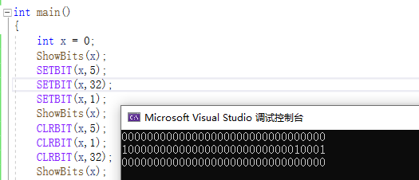

#### 位运算整型提升问题

如图
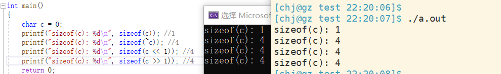

**为什么对char类型位操作后进行sizeof,计算出来的大小会改变? 难道位操作后就不是char类型吗? 并不是**  
解析:

首先,C语言关键字的作用是在编译期间就确定好了.sizeof是C语言关键字,他在编译期间就确定好了大小.换言之,sizeof这个计算过程是在编译期间做的,通过反汇编,我们能看到汇编代码中sizeof不存在,只显示了一个常数,这也说明sizeof不是一个函数,它在编译期间就已经计算好了.

其次,不论任何位运算符,目标都是要计算机进行计算的,需要加载到CPU中进行计算. 但是计算的数据都是存放在内存中,要计算都必须从内存加载到cpu中.拿到CPU那里? 答案是cpu的寄存器中.而寄存器本身,随着计算机位数的不同,寄存器的位数也不同.一般在32位下.寄存器的位数是32位.因为char是8位,读到寄存器中,只能填补低8位,还有高24位没有数据,因此就会触发整型提升,然后计算,这也是说明数据在计算机中并非以char类型运行,都是以整型方式运行的.综上这一些系列步骤,编译成的汇编代码就是整型提升后的大小了

汇编部分截图:

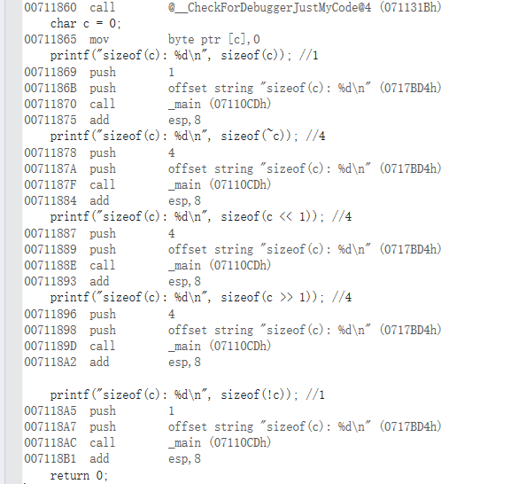

**在vs中还有一种现象:`sizeof(!c)`大小不同编译器大小不一样**

如图:

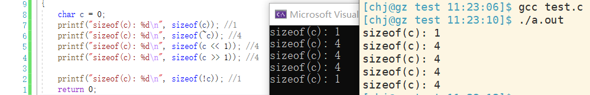按照前面四种类型的分析,理论上也应该是4,而vs是1,gcc是4,这也是说明了具体的整型提升方式也是由编译器决定的,原理大致就是这样.


### 左移和右移

#### 概念

`<<`(左移): 最高位丢弃，最低位补零  
`>>`(右移)：

1. 无符号数：最低位丢弃,最高位补零[逻辑右移]
2. 有符号数：最低位丢弃，最高位补符号位[算术右移]
   (无符号数,要保证它始终无符号,所以逻辑右移高位补零)

右移相当于除以2,但有特殊情况,有符号数且为-1时,右移数值不会改变  
左移始终补零,所以都是乘以2  
实际上,浮点数的左移右移坑还是很多,尽量不使用浮点数.非要使用,先在编译器下提前验证好再使用  

#### 移位运算容易误解成移位赋值

移位运算也和其他运算一样,加载到cpu中计算,并不会写回到内存中,只有赋值才能将数据写回内存

```c
int a = 10;
a << 1; //a的值没有改变
a <<=1; //a的值改变了
a = a<<1;//a的值改变了
```

数据在做计算时,要将数据内存加载到CPU寄存器中,在CPU内的数据改变,是不会影响到内存中的数据,这里会有短暂的时间CPU与内存的值是不一样的,直到我们把结果写回到内存中.在加载到CPU直到写回内存这段过程的每一段都有可能体现在代码中,具体取决于编译器怎么处理(不同编译器计算路径不唯一).


### ++(--)

#### 后置的`++(--)`真的是先使用,后自增吗?

**概念:前置`++`是先自增,后使用; 后置`++`是先使用,后自增.**

下面从汇编角度看后置`++`的原理.如图:

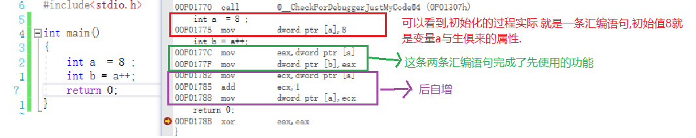

从上图来看,就是正常的先使用,后自增.图中的`a++`是有使用对象的,先把a的值给b,然后再自增.

但是如果只有单独的`a++`,并没有接收方呢? 看汇编:

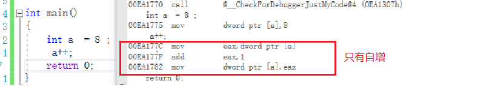

上面汇编说明,后置`++`是先使用,后自增的说法仅仅是表述方便.对编译器看来后置`++`先使用这一步骤,取决于有没有使用者.

#### 后置`++`和前置`++`的差别

再看后置`++`与前置`++`:

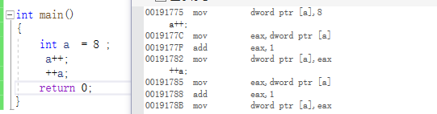

可以看到,如果在没有接收方的情况下, C语言的前置`++`和后置`++`是没有差别的.所以,习惯哪个就用哪个.

(在`C++`中,从`++`运算符重载的实现上看.后置`++`确实可能会慢一些)

### 复杂表达式

#### ++i+++i+++i

分别使用vs和gcc计算`++i+++i+++i`的结果,如图:

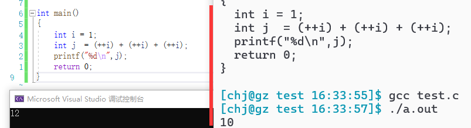

可以发现不同平台下这样的表达式结果可能是不一样的.为什么? 看看汇编下的它们长什么样:

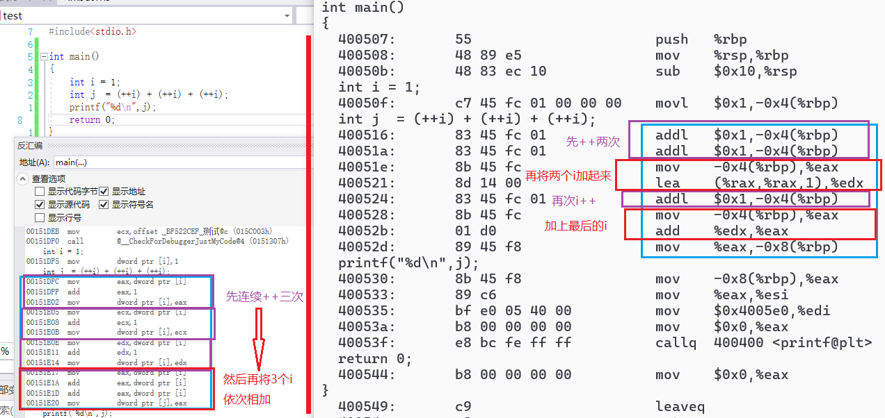

(tips:`++i`不加括号计算的结果也是一样的)

可以发现,两平台下的汇编代码的逻辑是有差别的,说明这种复杂表达式在不同平台的计算路径是不一样的,是因为编译器识别表达式的方式不一致/不确定导致的,可能是同时加载至寄存器,也可能是分批加载.最终导致应用层的表现不一致.

因此,类似这种复杂表达式,**做不到统一规范的.我们一律不推荐使用**.

还有一个问题,那就是编译器如何对这种复杂表达式完成变量与符号的识别和匹配的呢? 引入贪心规则,见下文.

#### 贪心法

> **贪心法**
> 
> C 语言有这样一个规则：每一个符号应该包含尽可能多的字符。也就是说，编译器将程序分解成符号的方法是，从左到右一个一个字符地读入，如果该字符可能组成一个符号，那么再读入下一个字符，判断已经读入的两个字符组成的字符串是否可能是一个符号的组成部分；如果可能，继续读入下一个字符，重复上述判断，直到读入的字符组成的字符串已不再可能组成一个有意义的符号。这个处理的策略被称为“贪心法”。需要注意到是，除了字符串与字符常量，符号的中间不能嵌有空白（空格、制表符、换行符等）。比如：==是单个符号，而= =是两个等号。解释:读到空格就不是再有意义的表达式,也就代表已经是最多的符号了,不能贪心下去了。
> 
> 按照这个规则可能很轻松的判断 a+++b 表达式与 a++ +b 一致。
> 那++i+++i+++i；会被解析成什么样子呢？希望读者好好研究研究。另外还可以考虑一下这个表达式的意思：a+++++b；

#### 编译器的贪心规则不是保证一定正确的规则

观察`i+++++j`的情况,如果使用编译器的自动对齐功能,对齐后的表达式是告警的

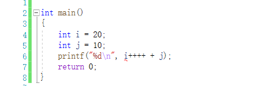

如果我们手动调整,则没有告警

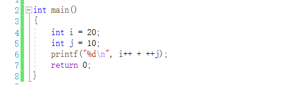

这说明,编译器的贪心匹配规则只是尽可能去匹配,解释表达式,解释的结果不一定是对的.所以,读者们以后也要注意,**不要绝对相信编译器的告警.编译器的告警也有可能会出错的.**

另外,从这句代码中可以发现,C语言的空格并不是只让代码变得好看一些,还有起到**操作符匹配划分**的作用.


> 查看linux反汇编:
> 
> gcc -g test.c //生成debug版本可执行文件,便于查看源码位置,如果不带-g选项则不显示源码
> 
> linux反汇编命令：objdump -S a.out > a.s  //S == source


### C语言的四种取整方式:

#### 零向取整

如图:

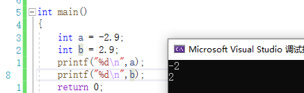

可以发现C语言a和b的取整方式都不是四舍五入,而是直接舍弃小数部分.(a四舍五入是-3,b四舍五入是3.)这种方式叫做**零向取整**.也是**c语言中的默认取整方式**

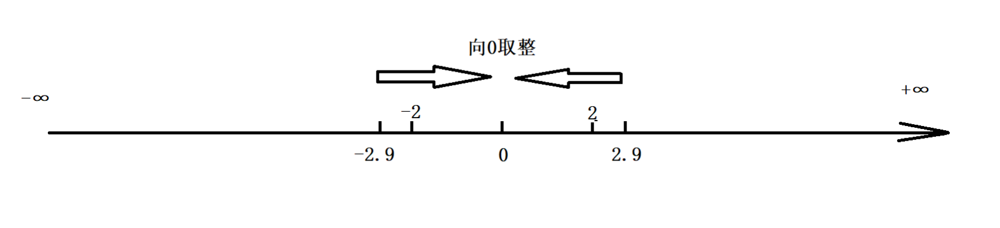

从图中可以看出无论是-2.9还是2.9，它们取整方向都是向着0的方向取整.

##### trunc函数(C99)

C语言`<math.h>`库中也有零向取整函数,它的返回值是浮点型，如果需要也是可以强转成int类型使用.

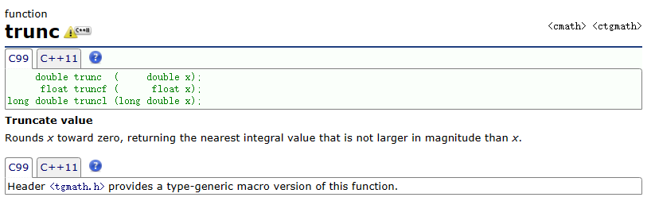

###### trunc的使用

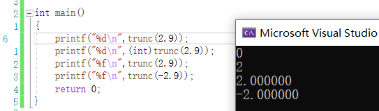

注意,%d不能直接接收浮点型,浮点型在内存空间中的布局和整型是不一样的,这点要注意.

如果需要转成整型使用,需要圆括号`(int)`强制类型转换.

#### 地板取整

这个名字有点奇怪，它是函数floor的翻译而来.

也叫向下取整,向左取整,向负无穷取整

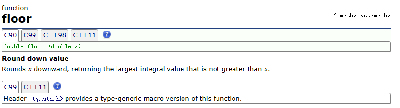

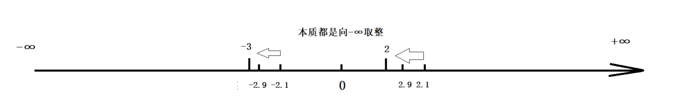

##### floor函数的使用

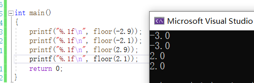

#### 向上取整

又称向右取整,向正无穷取整, 来源于ceil函数


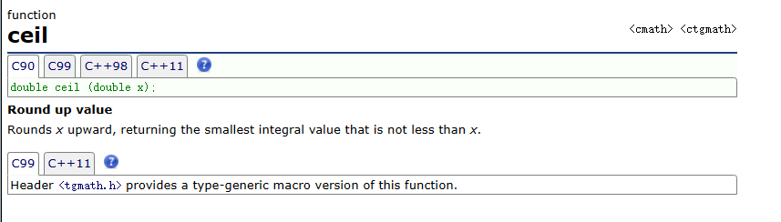

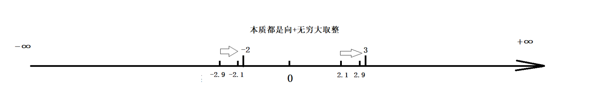

##### ceil函数的使用

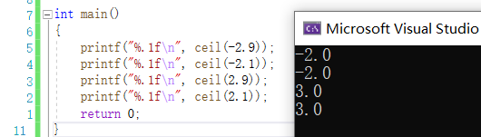

#### 四舍五入

##### round函数(C99)

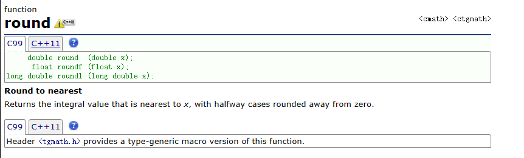

###### round函数的使用

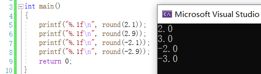

#### 四种取整方式代码

```C
#include<stdio.h>
#include<math.h>

int main()
{
    const char * format = "%.1f \t%.1f \t%.1f \t%.1f \t%.1f\n"; 
    printf("value\tround\tfloor\tceil\ttrunc\n");
    printf("-----\t-----\t-----\t----\t-----\n");
    printf(format, 2.3, round(2.3), floor(2.3), ceil(2.3), trunc(2.3));
    printf(format, 3.8, round(3.8), floor(3.8), ceil(3.8), trunc(3.8));
    printf(format, 5.5, round(5.5), floor(5.5), ceil(5.5), trunc(5.5));
    printf(format, -2.3, round(-2.3), floor(-2.3), ceil(-2.3), trunc(-2.3));
    printf(format, -3.8, round(-3.8), floor(-3.8), ceil(-3.8), trunc(-3.8));
    printf(format, -5.5, round(-5.5), floor(-5.5), ceil(-5.5), trunc(-5.5));
    return 0;
}
```

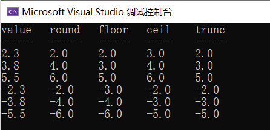


### 负数"取模"

#### 基本概念

> 如果a和d是两个自然数，d非零，可以证明存在两个唯一的整数 q 和 r，满足 a = q*d + r,且0 <= r < d。其中，q 被称为商，r 被称为余数。
>
> //对应代码
>
> int main()
> {
>     int a = 10;
>     int d = 3;
>     printf("%d\n", a % d); //结果是1 
>     //因为：a=10,d=3,q=3,r=1     0<=r<d(3) 
>     //所以：a = q*d+r -> 10=3'3+1
>
> return 0;
>
> }

正数比较简单,我们不谈,只看负数,负数的情况还是比较复杂的,先来看看不同平台下负数"取模"的差异

```c
int main()
{
    int a = -10; 
    int d = 3;
    printf("%d\n", a/d); 
    printf("%d\n", a%d);
}
```

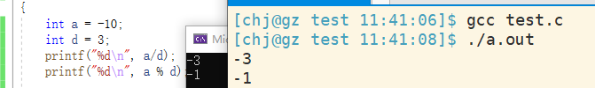

可以看出不同平台下C语言"取模"和取商是没有区别的.再看看python环境下的.

> centos7默认python版本是2.7.5,故使用python 2.7.5版本测试. 也可以使用python3.7.3版本测试,结果是相同的

可以发现两种语言负数求商和取余结果是不一样的.

定义中规定,余数是要大于等于0的,而C语言却计算出了负数.

**结论**:很显然,上面关于取模的定义,并不能满足语言上的取模运算.

因此引出了**修正定义**

#### 修正定义

>因为在C中，-10%3出现了负数，根据定义：满足 a = q\*d + r 且0 <= r < d，C语言中的余数，是不满足定义的，因为，r<0了。
>故，大家对取模有了一个修订版的定义：
>如果a和d是两个自然数，d非零，可以证明存在两个唯一的整数 q 和 r，满足 a = q*d + r , q 为整数，且0 <= |r| < |d|。其中，q 被称为商，r 被称为余数。
>有了这个新的定义，那么C中或者Python中的“取模”，就都能解释了。
>解释C: -10 = (-3) ' 3 + (-1)
>解释Python：-10 = （?）' 3 + 2,其中，可以推导出来,'?'必须是-4(至于为什么,后面验证),即-10 = （-4）' 3 + 2，才能 满足定义。
>所以，在不同语言，同一个计算表达式，负数“取模”结果是不同的。我们可以称之为分别叫做正余数 和 负余数

**是什么决定了这种现象?**

具体余数r的大小,本质是取决于商的,商确定了,余数自然就能确定.

而商取决于什么? 答案是,取决于除法计算的时候,结果的**取整规则**.

#### 取整规则决定商的值

C语言中取整规则默认是向0取整,python中默认取整规则是向下取整.

根据它们两个的规则,显然大于0的情况都是相同的,而小于0的情况是不同的,因此负数的情况下的它们的结果不相同

因为它们两的取整规则不同,而且又必须满足修订版的"取模"规则,决定了它们的计算结果现象


还有一个问题,那就是既然不同语言%符号计算的值不一样,那还是模数或余数吗?或者说取余和取模一样吗?

#### 取模和取余不一样.

**定义**

> 取余：尽可能让商，进行向0取整. //即零向取整方式得到的是余数
>
> 取模：尽可能让商，向-∞方向取整. //即向下取整方式得到的是模数
>       //模数,在几何向量上看,模是长度,为正值.(不考虑复数).模是正是负具体还要结合相关领域的定义.在计算机科学中,模和余很多情况是不区分的.

根据定义:

C中%运算,本质是取余数.

python中%运算,本质是取模.

再根据取整规则来看:

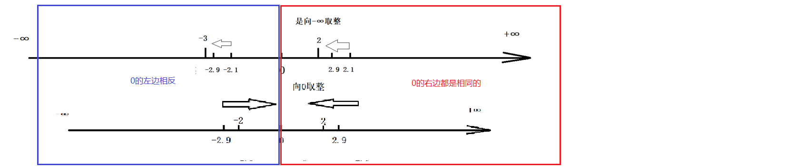

对任何一个大于0的数，对其进行0向取整和-∞取整，取整方向是一致的。故取模等价于取余 
对任何一个小于0的数，对其进行0向取整和-∞取整，取整方向是相反的。故取模不等价于取余

**小归纳:**

同符号数据相除，得到的商，一定是正数（正数vs正整数），即大于0！ 大于0取整方式就是相同的.
故，在对其商进行取整的时候，取模等价于取余。
