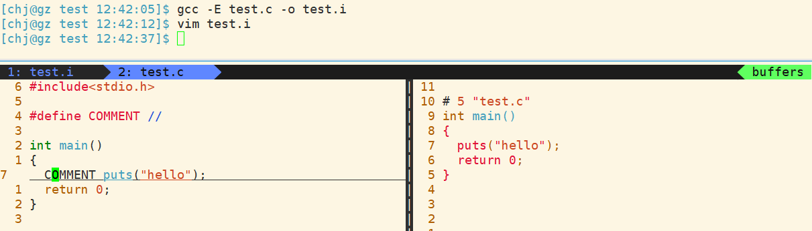
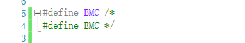
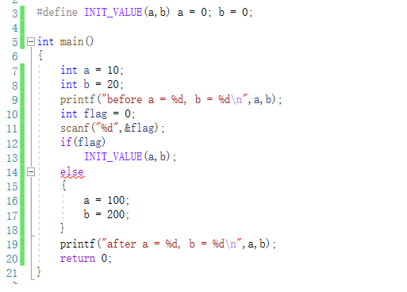
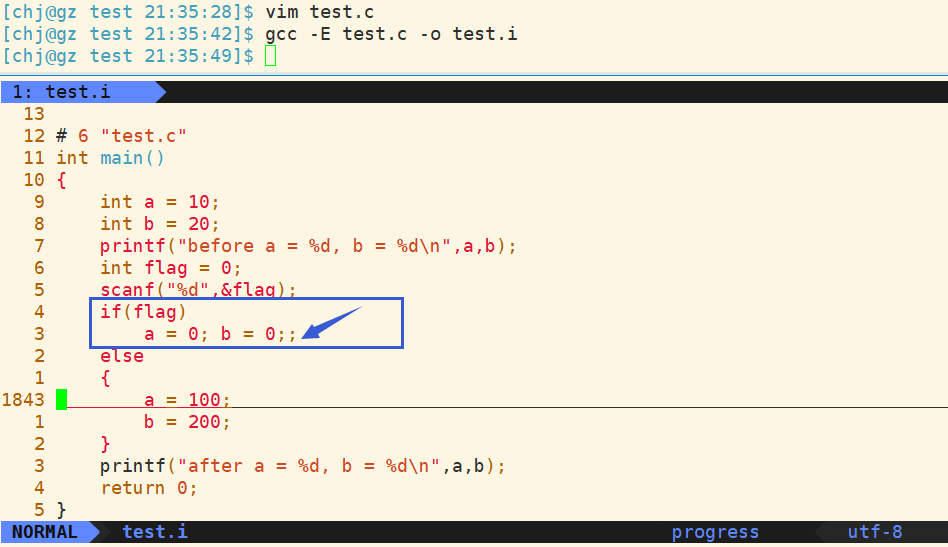
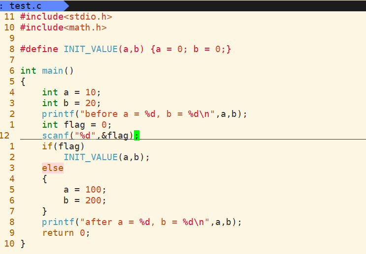
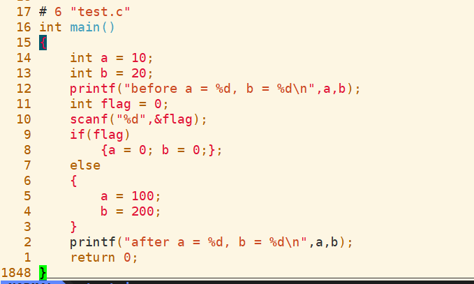
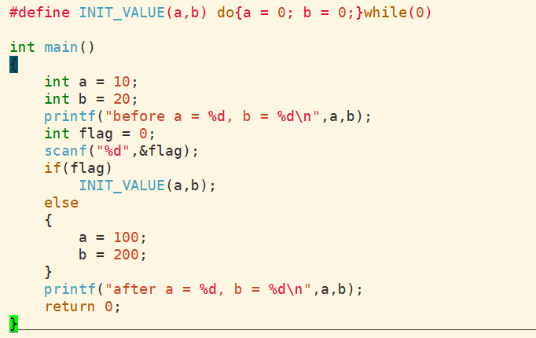
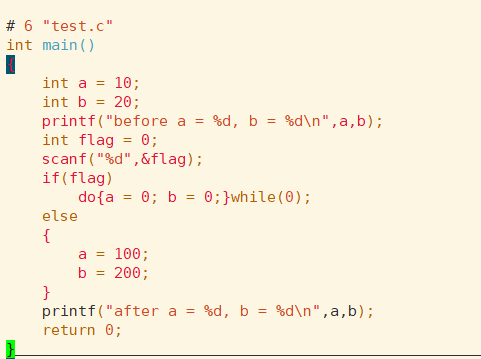

## 预处理

[TOC]

<br>

### 宏定义

<br>

#### 数值宏常量

> #define 宏定义是个演技非常高超的替身演员，但也会经常耍大牌的，所以我们用它要慎之又慎。它可以出现在代码的任何地方，从本行宏定义开始，以后的代码就都认识这个宏了；也可以把任何东西定义成宏。因为编译器会在预编译的时候用真身替换替身，而在我们的代码里面却又用常常用替身来帮忙。看例子：
>
> #define PI 3.141592654
>
> 在此后的代码中尽可以使用 PI 来代替 3.141592654，而且你最好就这么做。不然的话，如果我要把PI的精度再提高一些，你是否愿意一个一个的去修改这串数呢？你能保证不漏不出错？而使用 PI 的话，我们却只需要修改一次。这种情况还不是最要命的，我们再看一个例子：
>
> #define ERROR_POWEROFF -1
>
> 如果你在代码里不用 ERROR_POWEROFF 这个宏而将-1硬编码进代码里，尤其在函数返回错误代码的时候（往往一个开发一个系统需要定义很多错误代码）。肯怕上帝都无法知道-1 表示的是什么意思吧。这个-1，我们一般称为“魔鬼数”，上帝遇到它也会发狂的。所以，我奉劝代码里一定不要出现“魔鬼数”。
>
> 关键字篇我们讨论了 const 这个关键字，我们知道const 修饰的数据是有类型的，而 define 宏定义的数据没有类型。为了安全，我建议以后在定义一些宏常数的时候用 const 代替，编译器会给 const 修饰的只读变量做类型校验，减少错误的可能。但一定要注意const修饰的不是常量而是readonly的变量，const 修饰的只读变量不能用来作为定义数组的维数，也不能放在 case 关键字后面。

<br>

#### 字符串宏常量

> #define ENG_PATH_4 "E:\\English\\listen_to_this\\listen_to_this_3"

<br>

#### 用define宏定义注释符号？

能否使用宏定义的注释来注释代码?

```
#define COMMENT //
int main()
{
	COMMENT puts("hello");
}
```

第一眼看这个代码可能会搞不清程序是否执行打印,这个问题的解决我们需要知道预处理过程各步骤的执行顺序,

先看看程序预处理过程做了什么.

<br>

##### 程序的编译过程

> 预处理: 预处理指令,头文件展开,去掉注释,宏替换,条件编译 (顺序是怎样的?)
>
> 编译: C语言翻译成汇编语言
>
> 汇编: 将汇编代码转化成可重定向目标文件(可被链接)
>
> 链接: 自身程序+库文件进行关联,形成可执行程序

<br>

##### 预处理中宏替换和去注释谁先谁后?

生成的预处理结果如图:



观察结果,如果宏替换先于去注释,则puts代码一定是被去掉的,显然puts还在,说明**先去注释,再宏替换**;

既然是先去注释再宏替换,那为什么预处理后却没有发现puts前面带双斜杠呢? 这就很尴尬了,其实在`#define COMMENT //`处的双斜杠在**编译前就被识别成注释**了,去掉注释后代码就变成了`#define COMMET`这样子,是一个仅仅用于标识的宏.

总之,通过这点我们知道了预处理过程去注释是先于宏替换的.

上面说的是C++风格的注释,那C风格的注释呢

```
#define BSC //
#define BMC /*
#define EMC */

BSC: Begin Single-line Comment
BMC: Begin Multi-line Comment
EMC: End   Multi-line Comment
```



这就很明显了,如果有语法提示则很容易看出来,和上面所说的C++风格注释的情况是一样的原理.


#### 如何写一个不会出现问题的宏函数

我们知道,一般的宏函数是很容易出现问题的,比如说少加了括号,因为结合性问题导致代码逻辑没有按照预期来执行...,那怎样写出一个健壮性很高的宏函数呢? 先看一个例子:



  如果我定义这样一个宏函数,并且按照一般函数的方式运用,显然不是能通过语法检查的.看一下预处理后的代码



  可以发现`a = 0;`已经算一条语句了,后面`b = 0;;`多出来,不符合语法,因此报错.

  if在不带花括号的条件下只能且必须带一条语句.如果想用这条宏函数,只能将它写进if的花括号中.但是,这样的代码是不友好的,它变相的强迫用户必须带上花括号,显然不是一种很好的方式.那有没有更好的方式呢?

  既然要求if分支有多条语句需要执行时必须加上花括号,那能不能直接在宏函数中加上花括号? 看一下效果



再看一下预处理后的代码



  可以发现if花括号后面还带上了分号,这显然也不够好.

上面各种方式都是有大大小小的缺陷. 那还有没有更好的方案? 有的,最终解决方案:使用**do-while-zero结构**

##### do-while-zero结构



看预处理后的代码:



可以发现,在do-while-zero结构中,do有花括号,可以封装任意多条语句.while(0)后可以接上分号,并且while(0)只执行一次.用法也和普通函数一样.具有普适性.

预处理指令和宏谁先处理是不可预期的.

