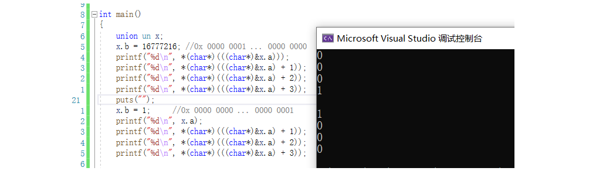

#pragma once


#### 程序的本质:二进制文件  
运行程序,即将程序中的数据加载到内存中运行  
为什么要加载到内存? 1.冯诺依曼体系决定 2.快  

### 变量
##### 1.变量:内存上的某个位置开辟的空间  
> 因为变量都是程序运行起来才开辟的

##### 2.变量的初始化:  
变量的空间被开辟后,就应当具有对应的数据,即必须要初始化.表示该变量与生俱来的属性就是该初始值

##### 3.为什么要有变量
计算机是为了解决人计算能力不足的问题而诞生的.即,计算机是为了计算的.  
而计算,就需要数据  
而要计算,任何时刻,不是所有的数据都要立马被计算,因此有的数据需要暂时被保存起来,等待后续处理. 所以需要变量

##### 4.局部变量与全局变量
- 局部变量:包含在代码块中的变量叫做局部变量.局部变量具有临时性.进入代码块,自动形成局部变量,退出代码块自动释放. 局部变量在栈区保存
- 全局变量:在所有函数外定义的变量,叫做全局变量.全局变量具有全局性.全局变量在全局已初始化数据区保存.
- 代码块:用花括号\{}括起来的区域,就叫做代码块.

##### 5.变量的大小由类型决定

##### 6.任何一个变量,内存赋值都是从低地址开始往高地址  
> 所以首地址和取地址永远都是低地址


### 1.1 关键字auto
默认情况下,编译器默认所有的局部变量都是auto的,auto一般只能用来修饰局部变量,不能修饰全局变量.ju'bu也叫自动变量.一般情况下都是省略auto关键字的.基本永不使用

### 1.2 关键字register
建议性关键字,建议编译器将该变量优化到寄存器上,具体情况由编译器决定  
(不建议大量使用,因为寄存器数量有限)
##### 什么样的变量可以采用register?
1. 局部的(全局会导致CPU寄存器被长时间占用)
2. 高频被读取的(提高访问效率)
3. 不会被写入的(写入就需要写回内存,后续还需要读取检测的话,register就没有意义了)  

寄存器变量是不能被取地址的,因为不在内存中,就没有内存地址  
register不会影响变量的生命周期,只有static会影响变量的生命周期


### 1.3.1 多文件(extern):
具有一定规模的项目是需要文件与文件之间进行交互的.如果不能直接跨文件调用,则项目在这方面一定需要很大成本解决.因此C默认是支持跨文件的
1. #### extern  
    - 功能:声明,引入别的源文件的变量或函数
    - extern与头文件的渊源:
 最开始时,没有头文件,源文件之间的互相引用是通过extern进行的.当项目复杂后,引用需要写的声明越来越多,每个源文件引入别的源文件的变量或函数时都需要声明一次,维护变得麻烦.为了解决这种情况,头文件就出来了,只需声明一次就可以到处使用.  
现在基本上多文件项目都是头文件放声明,源文件放定义
    - 怎么声明变量和函数? 
        - 变量:  
            定义:`int a = 10;`  
            声明:`extern int a;` (不能给声明赋值,因为声明不能开辟空间)  
            (声明变量时必须带extern,因为不带会区分不了是声明还是定义)
        - 函数:  
            定义:`void print(){ //... }`  
            声明:`extern void printf();` (不能带上函数体)  
            (声明时建议带上extern,不带也行,因为声明不带函数体,且以分号结尾,有明显区分度)
    

2. #### 头文件
- 头文件一般包含:
    * C头文件
    * 所有的变量的声明
    * 所有函数的声明
    * #define, 类型typedef, struct  
- 头文件中函数的声明可以不带上extern, 但是变量的声明必须带上extern, 因为头文件最终是要展开到源文件中去的,源文件内可以定义和声明,那头文件也可以,如果头文件中变量声明不带extern,则无法区分该变量是声明还是定义(二义性).


#### 1.03.2 static
static给项目维护给提供了安全保证,像封装一样,隐藏实现
功能:
1. static修饰全局变量,该变量只在本文件内被访问, 不能被外部其他文件直接访问
2. static修饰函数,该函数只能在本文件内被访问,不能被外部其他文件直接访问  
3. static局部变量变成静态变量,放在静态区,改变了局部变量的生命周期,使其生命周期变长。 
   - static修饰全局变量和函数,改变的是它们的作用域,生命周期不变.static修饰局部变量,改变的是局部变量的生命周期,作用域不变  
   - static修饰的局部变量会放在进程地址空间的 已初始化数据区,在进程的整个生命周期内都是有效的.


### 进程地址空间
1. 代码区
程序执行代码存放在代码区，其值不能修改（若修改则会出现错误）。
字符串常量和define定义的常量也有可能存放在代码区。

2. 常量区
字符串、数字等常量存放在常量区。
const修饰的全局变量存放在常量区。
程序运行期间，常量区的内容不可以被修改。

3. 全局区（静态区）
全局变量和静态变量的存储是放在一块的，初始化的全局变量和静态变量在一块区域，未初始化的全局变量和未初始化的静态变量在相邻的另一块区域。

4. 堆区(heap)
堆区由程序员分配内存和释放。
堆区按内存地址由低地址到高地址增长，用malloc, calloc, realloc等分配内存的函数分配得到的就是在堆上。

5. 栈区(stack)
存放内容
临时创建的局部变量和const定义的局部变量存放在栈区。
函数调用和返回时，其入口参数和返回值存放在栈区。
>    - 为什么局部变量具有临时性? 因为局部变量是存在栈中的.栈具有后进先出(压栈)的特性,除了作用域后需要将该范围的所有变量弹出.

### 1.4类型
- C语言为何有类型? 让我们能够对内存进行合理化划分,按需索取,存在类型的目的就是让我们能合理使用内存空间  
- 类型为什么有这么多种? 实际应用场景很多种,应用场景不同,解决对应的应用场景的计算方式不同,需要空间的大小也是不同的.多种类型目的是让我们能以最下成本解决多样化的场景问题.
> 例如: 登记成绩,成绩只要0-100分,那使用一1个字节int8_t/char就足够. 如果带浮点,则需要浮点型.  


### 1.5 关键字sizeof
sizeof是函数还是关键字?
1. 证明1:
```C
int a = 10;
printf("%d\n",sizeof(a));    //正确用法
printf("%d\n",sizeof(int));  //正确用法
printf("%d\n",sizeof a );    //正确用法,证明sizeof不是函数
printf("%d\n",sizeof int );  //不存在
```
2. 证明2:函数调用栈帧中sizeof不会压栈


### 1.6关键字unsigned和signed
##### 数据在计算机中的存储
- 任何数据在计算机中都必须被转化成二进制,因为计算机只认识二进制.而计算机还要区分数据是正数还是负数,则二进制又分为`符号位 + 数据位`.
- 计算机内存储的整型必须是补码
- 无符号数和正数的原反补码相等,直接存入计算机中.负数需要将原码转化成补码再存储
- 类型决定了如何解释空间内部保存的二进制序列
- 浮点数默认是double类型,如果想要float需要在数后加上f,如`float f = 1.1f`;

##### 原码 反码 补码的转化与硬件关系  
```
例: int b = -20; //20 = 16+4 = 2^4^ (10000)~2~+ 2^2^(100)~2~  
//有符号数且负数 原码转成补码:
1000 0000 0000 0000 0000 0000 0001 0100  原码
1111 1111 1111 1111 1111 1111 1111 1011  反码 = 原码取反
1111 1111 1111 1111 1111 1111 1111 1100  补码 = 反码+1

//补码转原码
方法一: 原理
1111 1111 1111 1111 1111 1111 1111 1100  补码 
1111 1111 1111 1111 1111 1111 1111 1011  反码 = 补码-1
1000 0000 0000 0000 0000 0000 0001 0100  原码 = 反码取反

方法二: 计算机硬件使用的方式, 可以使用一条硬件电路,完成原码补码互转
1111 1111 1111 1111 1111 1111 1111 1100  补码 
1000 0000 0000 0000 0000 0000 0000 0011  补码取反
1000 0000 0000 0000 0000 0000 0000 0100  +1
```

##### 整型存储的本质
定义`unsigned int b = -10;` 能否正确运行? 答案是可以的.
定义的过程是开辟空间,而空间只能存储二进制,并不关心数据的内容
数据要存储到空间里,必须先转成二进制补码.而在写入空间时,数据已经转化成补码

##### 变量存取的过程
- 存: 字面数据必须先转成补码,再放入空间中.符号位只看数据本身是否携带+-号,和变量是否有符号无关.
- 取: 取数据一定要先看变量本身类型,然后才决定要不要看最高符号位.如果不需要,则直接将二进制转成十进制.如果需要,则需要转成原码,然后才能识别(还需要考虑最高符号位在哪里,考虑大小端)

##### 类型目前的作用
1. 存数据前决定开辟多大的空间
2. 读数据时如何解释二进制数据

特定数据类型能表示多少个数据,取决于自己所有比特位排列组合的个数

##### 十进制与二进制快速转换
```
(前置知识:需要熟记2^0到2^10的十进制结果)
    1 -> 2^0
   10 -> 2^1
  100 -> 2^2
 1000 -> 2^3  //1后面跟3个比特位就是2^3
 规律: 1后n个0就是2^n,即n等于几1后面就跟几个0 --- 十进制转二进制
        反过来就是1后面跟几个0,就是2的几次方 --- 二进制转十进制
 因此:2^9 -> 10 0000 0000 // n

例: 67 = 64+2+1 -> 2^6+2^1+2^0 -> 1000000 + 10 + 1
       = 0000 0000 .... 0100 0011
同理,二进制转十进制逆过程即可
```

##### 大小端字节序

现象: vs的内存窗口中,地址从上到下依次增大,从左到右也依次增大

1. 大端:按照字节为单位,低权值位数据存储在高地址处,就叫做大端
2. 小段:按照字节为单位,低权值位数据存储在低地址处,就叫做小端(小小小)

(基本上以小端为主,大端比较少(网络))

大小端存储方案,本质是数据和空间按照字节为单位的一种映射关系

(考虑大小端问题是1字节以上的类型.short,int,double...)

##### 判断当前机器的字节序
- 方法1: 对`int a = 1` 取首地址,然后`(char*)&a`,得到的值是1则为小端,否则为大端
- 方法2: 打开内存窗口查看地址与数据的字节序

##### "负零"(-128)的理解
```
(负零的概念并不存在,只是碰巧相像)
-128实际存入到计算机中是以 1 1000 0000 表示的(计组运算器).但空间只有8位,发生截断,因此得到1000 0000.
而[1111 1111,1000 0001]~[0000 0000,0111 1111]  
即[-127,-1]~[0,127] 自然数都已经被使用 .  
计算机不能浪费每一个空间(最小的成本尽可能解决大量的计算),自然1000 0000也需要有相应的意义. 因此赋予数值为-128.

因为截断后也不可能恢复,所以这是一种半计算半规定的做法.
```
  

##### 截断
截断是空间不足以存放数据时,将高位截断.  
> 截断的是高位还是低位? 因为赋值永远都是从低地址赋起(从低到高依次赋值),因此空间不足时高位直接丢弃.

1 0000 0001 0100
1 1111 1110 1100
0 0000 0000 1010
1 1111 1111 0110 
1 0000 0000 1010

##### 建议在无符号类型的数值后带上u,
默认的数值是有符号的,在数值后加u更加严格,`unsigned int a = 10u;`

### 1.7 if-else组合
- 表达式: 变量与操作符的组合称为表达式
- 语句: 以分号结尾的表达式称为语句
- if(0){ //... }注释法,在看到if(0)时,有可能这是一个注释,不推荐这种做法,但是需要认识.

#### if的执行顺序
1. 计算功能:先执行完毕if括号()中的表达式or某种函数,得到表达式的真假结果
2. 判定功能:根据表达式结果进行条件判定
3. 分支功能:根据判定结果进行分支  
    > (if有判定和分支两个功能,而switch只有判定而没有分支功能,因此必须使用break)

#### 操作符的执行顺序测试方法
`printf("1   ") && printf("2   ");`  
`printf("1   ") || printf("2   ");`

#### C语言的布尔类型
- C89/C90没有bool类型
- C99 引入了关键字为_Bool的类型,在新增的头文件stdbool.h中.为了保证C/C++的兼容性,被重新用宏写成了bool.
- 微软对C语言bool类型也有一套标准,BOOL,FALSE,TRUE. 不推荐使用微软这套标准,不具备可移植性

#### 浮点数与"零值"比较

- ##### 精度损失:浮点值与实际值不等,可能偏大可能偏小,都属于精度损失  
    1. **验证浮点数是否存在精度损失**  
      
    2. **验证浮点数的差值是否存在精度损失**  
    
    3. **浮点数直接比较验证**  
      
    **结论: 浮点数在进行比较时,绝对不能使用双等号`==`来进行比较.  浮点数本身有精度损失,进而导致结果可能有细微的差别.**  

- ##### 如何进行浮点数比较
```C
1. x - y == 0的条件是 |x - y| < 精度.
即 x - y > -精度 && x - y < 精度

2.还可以使用fabs函数,C90,<math.h>, double fabs(double x); 返回x的绝对值.
即 fabs(x-y) < 精度
```
```
//--------------------------------------------------------------
//方法1,自定义精度
#include<stdio.h>
#include<math.h>

#define EPSILON 0.0000000000000001 //自定义精度
int main()
{
    double x = 1.0;
    double y = 0.1;

    //验证x - 0.9 是否等于 0.1
    if(fabs((x-0.9)- y) < EPSILON ) printf("aaaa\n");
    else printf("bbbb\n");

    puts("hello world!");
    return 0;
}
```
```
//方法2:使用C语言提供的精度
#include<stdio.h>
#include<math.h>
#include<float.h>

int main()
{
    double x = 1.0;
    double y = 0.1;

    //验证x - 0.9 是否等于 0.1
    //<float.h> 内置最小精度值 DBL_EPSILON 和 FLT_EPSILON ,1.0+DBL_EPSILON != 1.0 ,EPSILON是改变1.0的最小的值,数学概念,略
    if(fabs((x-0.9)- y) < DBL_EPSILON ) printf("aaaa\n");
    else printf("bbbb\n");
    
    return 0;
}
```


- 浮点数与"零值"比较,只需要判定它是否小于EPSILON即可
```
int main()
{
    double x = 0.0;
    // double x  = 0.00000000000000000000000000001; //很小也可以认为等于0
    if(fabs(x) < DBL_EPSILON ) printf("等于0\n");
    else printf("不等于0\n");
    
    return 0;
}
```

#### 补充:如何理解强制类型转化
**强制类型转化:不改变数据本身,只改变数据的类型**
- "123456" -> int:123456
```
字符串"123456"如何转化成整型值123456,能强转吗? 答案是不能,只能通过算法进行转化

因为"123456"的空间至少占了7个,而整型int只占4个字节.
```
- ##### 不同类型的0
```
printf("%d\n",0);
printf("%d\n",'\0');
printf("%d\n",NULL); //(void*)0
```


### 1.8switch case组合
- **基本语法结构**  
```
//switch只能对整数进行判定
switch(整型变量/常量/整型表达式){
    case var1:
        break;
    case var2:
        break;
    case var3:
        break;
    default:
        break;
}
推荐使用switch的场景:只能用于整数判定且分支很多的情况下
```

- switch case 的功能
switch本身没有判断和分支能力,switch是拿着结果去找case进行匹配,  
case具有判定能力,但没有分支能力,case是通过break完成分支功能  
break具有分支功能,相当于if的分支能力.  
default相当else,处理异常情况

#### (补充) 屏蔽警告的方法
```
error C4996: 'scanf': This function or variable may be unsafe. Consider using scanf_s instead. To disable deprecation, use _CRT_SECURE_NO_WARNINGS. See online help for details.
方法1:
#pragma warning(disable:4996)
方法2:
#define _CRT_SECURE_NO_WARNINGS //该宏定义必须写在文件的首行(头文件的前面)才有效
(如果宏没有宏值,则只能用在#ifdef等条件编译语句中,即只用于标识)
```

- ##### 在case中执行多条语句,建议case后都带上花括号.
  在case中定义变量,直接写会警告,需要带上花括号,但不建议在case中定义变量,如果非要这么做,可以封装成函数来替代.并且
  

- ##### 多个case执行同样语句
```C
int main()
{
    int n = 0 ;
    scanf("%d",&n);
    switch (n)
    {
        case 1: case 2: case 3: case 4: case 5:
            puts("周内");
            break;
        case 6:
            puts("周六");
            break;
        case 7:
            puts("周日");
            break;
        default:
            break;
    }
    return 0;
}
```

- default可以在switch中的任意位置,一般习惯放在最后的case后
- switch中尽量不要单独出现return.一般习惯用break,突然return容易搞混
- switch中不要使用bool值,不好维护
- case的值必须是数字常量,不能是`const int a = 1;`这种
- 按执行频率排列case语句,频率越高越靠前,能减少匹配次数

### 1.9 do、while、for
#### 循环的基本结构  
- 一般的循环都必须要有3种功能：  
    1. 循环条件初始化
    2. 循环条件判定
    3. 循环条件更新

(死循环除外)
```C
int main()
{
    int count = 10; //1.循环条件初始化
    while (count > 10) //2.循环条件判定
    {
        printf("%d\n", count); //3.业务逻辑
        count--; //4.循环条件更新
    }
    return 0;
}
```

- for循环  
```
使用样例:
for(int i = 0; i<10; i++)
{
    //业务逻辑
}
```
for的结构更加紧凑,更清晰
```
for(1.循环条件初始化； 2.循环条件判定； 4.循环条件更新){
    //3.业务逻辑
}
```


- do-while
```
//1.循环条件初始化
do{
  //2.业务逻辑
  //3.循环条件更新
}while(4.循环条件判定);
```
do while结构需要在while()后加上分号，容易忘记

#### continue跳转的位置
- while循环continue后会跳转到循环条件判定的位置,之后执行循环判定
- for循环会跳转到循环条件更新的位置,之后进行循环条件更新!!!

#### 循环设计的思想推荐
1.尽可能减少循环来回多次的跳转的次数 --- 涉及缓存,局部性原理,CPU命中概率.尽可能让代码执行的更加平滑
2.在多重循环中,如果有可能,应当将最长的循环放在最内层,最短的循环放在最外层,以减少CPU跨且循环层的次数.

#### 推荐使用for的前闭后开写法
```
推荐1:for语句循环的次数的计算方式
1.for(int i = 0; i<=9; i++){} //cnt = 9-0+1 = 10次
2.for(int i = 0; i<10; i++){} //cnt = 10-0 = 10次
3.for(int i = 6; i<=9; i++){} //cnt = 9-6+1 = 4次
4.for(int i = 6; i<10; i++){} //cnt = 10-6 = 4次
从计算角度,前闭后开写法能更加直观,快速

推荐2:下标映射时,思维清晰,不容易混乱
```

### 字符设备

##### (补充) char有有符号和无符号两种类型,字符是无符号类型.

#### (补充) getchar的返回值为什么是int
如果getchar返回值是char,因为char只能表示0-255个字符，刚好包含所有ascii码,如果getchar失败，则没有多余的位置返回错误信息.因此getchar返回值设计成int,int既能转化成字符,还有多余的数值当作错误码来使用.

##### 键盘输入的内容,以及往显示器中打印的内容,都是字符 --> 键盘/显示器称为字符设备
验证:printf scanf的返回值是输出和输入的字符数.


### 1.10 goto关键字
##### goto的用法
- 向下跳转
```
int main()
{
    puts("hello world 1!");
    goto end;
    puts("hello world 2!");
end:
    puts("hello world 3!");
    return 0;
}
```
-向上跳转
```
//用goto实现的循环
int main()
{
    int i = 0;
start:
    printf("[%d] goto running ...\n",i);
    i++;
    if(i<10) goto start;
    return 0;
}
```
- goto只能在本函数内使用,不能跨函数
- goto很灵活,容易出现问题,因此不受欢迎.但很多项目中goto用得也不少,在有能力的情况下可以使用

### 1.11 void
- void不能定义变量,因为void的类型大小是不确定的,编译器强制不允许定义变量.
- sizeof(void)的大小,在windows中为0,在linux中为1. 说明void的大小是不明确的,本身就被编译器解释成空类型.
- void作为空类型,理论上是不能开辟空间的,即使开辟了空间,也仅仅作为一个占位符看待(void的作用,告诉编译器他是空类型).  
    所以,既然无法开辟空间,那么也就无法作为正常变量使用,既然无法使用,编译器干脆就不让它定义变量.
- void不仅不能定义变量,而且还不能用于解释数据,如强转成void在赋值给int是不允许的:`int a = (void)10`; 以及接受返回值类型为void的函数的返回值也是不允许的;
- (补充)C语言函数可以不带返回值,默认的返回值类型是int.  --- 尽量写上返回值类型,不写返回值类型很容易被误解成返回值类型为void. 而且可读性还低.

- void作为函数参数的作用
```
void test1()    
{    
  puts("test1");    
}    
    
void test2(void)                                                                                                    
  puts("test2");    
}    
    
int main()    
{    
  test1(1,2,3,4); //正常运行   
  test2(1,2,3,4); //linux gcc报错:too many arguments to function 
                  //windows中是warning C4087: “test2”: 用“void”参数列表声明
  return 0;    
}    

```
说明:void作参数时,明确告知编译器不需要传参 .而参数列表为空时则不限制 -- 自解释  
- void\*  
`void *p = NULL;` 是可以编译通过的.因为void\*是指针,指针在任何平台的大小都是明确的.32位占4字节,64位占8字节. 大小明确,所以能够定义变量
- void\*可以被任何类型的指针变量接受,void\*也可以接受任意的指针类型(常用)  
如在库,系统接口的设计上,设计成通用接口.


- void\*类型的指针在vs中不能加减,gcc中可以加减  
解释:指针加减的大小是sizeof(类型),以满足连续的数据存放需要(如数组).  
而sizeof(void)在vs中是0,加减没有意义,所以干脆强制不能自增自减等操作.而gcc中sizeof(void)为1,即一个占位符的大小,因此还是可以加减.  

- GNU C(扩展C)和ANSI C(标准C)

- void\*类型不能解引用  
解释:也是sizeof(void)和void不能定义变量的问题


### 1.12return关键字
- #### return语句不可返回指向"栈内存"的指针,因为该内存在函数结束时会自动销毁.
- #### (补充) 栈帧
    - 栈帧:函数在栈区中开辟的空间,就叫栈帧
    - 栈帧的大小,编译器有能力在开辟前可以通过sizeof根据函数内的变量类型和数量预估出来(1.关键字本身就是编译器用的 2.不同的编译器计算方式不一样)
    - 调用函数,创建栈帧. 函数返回,释放栈帧(释放就是允许被覆盖.空间使用权不再属于这个函数,别的函数也可以使用)
    - 为什么临时变量具有临时性,就是因为函数返回后要释放栈帧,栈帧被释放,栈帧内的变量所需的空间自然也被释放.因此临时变量具有临时性
    - 栈帧无效并不是清空栈帧的内容,栈帧内容不会改变,但是使用权已归还.等下个函数调用时,新的栈帧就会覆盖掉旧的栈帧.
    - 越早创建的栈帧地址越高,因为栈是向下(低地址)增长的.
    - main函数也是函数,也有自己的栈帧.(调用main函数的函数是\_start函数或__tmainCRTSstartup()函数...)
    - 递归就是不断向下形成栈帧的过程.因为栈大小是有限制的,递归过多有可能会发生栈溢出问题.  
<br>


- #### 函数的返回值的返回方式
  - 函数的返回值通过保存在寄存器的方式,返回给函数调用方.  
  - 如果有对应的接受变量,则会形成对应的接受汇编语句.就算没有变量接受返回值也会将返回值放到寄存器中,只是没有生成接受语句.
```
int getDate()
{
    int x = 0x11223344;
    puts("getDate");
    return x;
}

int main()
{
    int y = getDate();
    return 0;
}
```


- #### 返回值具有常属性...

### 1.13const
- const 直接修饰变量时,该变量不可被直接修改(可以间接修改)

- const 放在类型前和类型后是一样的.
- 既然const可以被间接修改,那const有什么意义?
    1. const是给编译器看的,const能够让编译器在编译代码时对用const的变量进行语法检查,凡是对const修饰的变量有直接修改行为的,编译器会直接报错. 
    2. const是给其他程序员看的,其他程序员发现有变量被const修饰时,就知道这个变量不能直接被修改,即这份代码有了一定的自身描述性(自描述)
- 真正的不可修改
  
(字符串常量不可修改是操作系统级别的保护,真正的不可修改. 原理相关:OS页表和权限)  
- const是在编译期间限制不可修改(所有的报错都是在编译期间).
- 标准C下const修饰的变量不可以用于定义数组(必须是宏或字面值).有的扩展C可以.
- 只读数组 ` const int a[] = { 1,2,3,4,5 };`, 数组的每个元素都不可被修改

##### 带const的类型  
定义整型指针变量p,用于初始化q : `int *q = p;`   
如果p的定义方式是`const int *p`,则p的类型是`const int*`,因此初始化时q会告警.对p强转后再赋值,不会告警`int*q = (int*)p;`  
如果p的定义方式是`int const *p`,则p的类型是`int*`,因此初始化q时不会告警.  

#### 带const的类型可以直接传给不带const的类型:权限可以缩小,但不可以放大

### 指针
- 取地址:在C中,任何变量&都是最低地址开始! 取得是一个变量所占空间的最低地址
- 在C中,任何函数传参都一定会形成临时变量,包括指针变量.无论传值还是传址.  
指针变量也是变量,传址传参至少会形成一个指针变量用于接受调用方传过来的地址.


### 1.14 volatile 
- volatile关键字存在说明变量/指令/代码在程序执行中可被隐含地(汇编层面)改变

- volatile 是一个类型修饰符(type specifier),就像我们熟悉的 const 一样，它是被设计用来修饰被不同线程访问和修改的变量; volatile 的作用是作为指令关键字，确保本条指令不会因编译器的优化而省略，且要求每次都要直接从内存中读值(内存可见性)。用于多进程多线程高并发等多执行流的场合 

- const volatile int a = 10;  
这句代码是能正确通过编译的,const要求你不要进行写入就可以,volatile意思是CPU读取时,每次都要从内存读.两个不冲突.

- 虽然volatile就叫做易变关键字,但这里仅仅描述它修饰的变量可能会发生变化,要编译器注意,并不是要求它对应的变量必须变化!这点必须特别注意.

### 1.16 struct 
- 定义结构体,本质是制作类型
- 结构体只能整体初始化,不能整体赋值 (和数组一样,只能被整体初始化,不能整体赋值)
- 空结构体不同编译器不同处理,vs不允许定义空结构体类型;gcc允许定义结构体类型,但大小为0,不能用于定义变量,没有空间的类型一定会报错.  

(定义结构体类型和定义结构体变量不一样.)

### 柔性数组(C99)
- 必须放在结构体内
- 一般将大小设成[0],还有些编译器支持[]没有常量/字面值
- 一般结构体的第一个元素尽量不要是柔性数组,最好放在最后(不同编译器支持的方式不同,尽可能统一)
- 柔性数组不占结构体大小
``` 
/*柔性数组的定义*/
struct s
{
    int a;
    //其他成员...
    int arr[]; //一般放最后
};
```
```
/*柔性数组的使用*/
struct data
{
    int num;
    int arr[0];
};

int main()
{
    struct data *p = malloc(sizeof(struct data) + sizeof(int)*10);
    p->num = 10;
    for (int i = 0; i < p->num; i++)
    {
        p->arr[i] = i;
    }
    return 0;
}
```


### 1.17 联合体union
- 联合体也是制作类型
- 联合体的大小是最大成员的大小.
- 联合体的所有成员的地址永远都是从联合体的首地址开始的,它的所有成员相对于基地址的偏移量都为0
- 联合体每一个成员都可以认为是第一个成员  

**使用联合体验证大小端:**
```C
验证代码1
union un
{
    char a;
    int b;
};

int main()
{
    union un x;
    x.b = 16777216; //0x 0000 0001 ... 0000 0000  
    printf("%d\n", *(char*)(((char*)&x.a)));   
    printf("%d\n", *(char*)(((char*)&x.a) + 1));
    printf("%d\n", *(char*)(((char*)&x.a) + 2));
    printf("%d\n", *(char*)(((char*)&x.a) + 3));

    x.b = 1;     //0x 0000 0000 ... 0000 0001
    printf("%d\n", x.a);
    printf("%d\n", *(char*)(((char*)&x.a) + 1));
    printf("%d\n", *(char*)(((char*)&x.a) + 2));
    printf("%d\n", *(char*)(((char*)&x.a) + 3));

    return 0;
}
```
  
```
验证代码2
union un
{
    int i;
    char a[4];
};

int main()
{
    union un x;
    x.a[0] = 0x78;
    x.a[1] = 0x56;
    x.a[2] = 0x34;
    x.a[3] = 0x12;
    printf("0x%x\n",x.i); //vs:0x12345678
    return 0;
}
```

**联合体的内存对齐**  
对齐数的规则:  
1. 联合体内存对齐数的大小能整除任何一个成员的大小   
2. 大小大于等于最大一个成员的大小.  
3. 满足上述1,2两点规则的最小整数就是对齐数
```C
union un
{
    char a[5];
    int b;
};

int main()
{
    printf("%d\n",sizeof(union un)); //vs:8
    return 0;
}
```

### 1.18 enum,可以枚举常量的关键字
- 枚举也是制作类型
- 枚举类型的成员是常量/字面值
- 用枚举类型定义的变量使用枚举类型内的常量来初始化
- 默认第一个成员的值为0,之后依次递增
- 每个成员的默认值都是上一个成员的值+1
  
- 非空枚举的大小为4,空枚举在vs下大小为4,gcc不允许定义空枚举类型
- 枚举可以认为是一个整型int,可以用整型给枚举变量初始化和赋值

**为什么要有枚举?**  
1. 枚举是个有强相关性的类型.相关性体现在事物与数字的关联如一周固定有7天,每一天都有自己的名字如星期一,周一,Monday..等.枚举类型便是根据此而来
2. 魔术数字  
> 魔术数字（magic number）是程式设计中所谓的直接写在程式码里的具体数值（如“10”“123”等以数字直接写出的值）。虽然程式作者写的时候自己能了解数值的意义，但对其他程式员而言，甚至制作者本人经过一段时间后，会难以了解这个数值的用途，只能苦笑讽刺“这个数值的意义虽然不懂，不过至少程式会动，真是个魔术般的数字”而得名。
3. 枚举本身具有自描述性/自解释性,能够对魔术数字有很好的替代.

**宏也有自描述性,为什么不使用宏?**  
1. 当一组相关属性的常量比较少时,使用宏是完全没有问题的. 当属性的数量非常多时,使用宏则需要些大量的宏定义,代码冗长,不利阅读和控制,并且很难看出属性与属性间的关系.而枚举本身可以作为一组属性的集合,集合内的属性很容易看出有相关性,并且易读易控制.
2. 宏在预编译时直接将对应的字面值直接替换到代码中.而枚举在编译时,会进行词法语法分析检查.

**枚举的特性**  
1. 枚举与常量间具有相关性(集合)
2. 自描述性
3. 有语法检查

### 1.19 typedef
历史的误会-typedef也许应该是`typerename`,typedef就是用来给类型重命名的    

**typedef功能**
- typedef可以一次指定多个别名  
` typedef int A,B,C;`
- typedef 为函数起别名的写法如下  
`typedef signed char (*fp)(void);`
- typedef 也可以用来为数组类型起别名  
```
typedef int five_ints[5];
five_ints x = {11, 22, 33, 44, 55};
```

**简化类型声明**   
C 语言有些类型声明相当复杂，比如下面这个  
```char (*(*x(void))[5])(void);```  

>  函数指针 :
> typedef 返回值类型 (*)(参数);  
> 数组指针 :
> typedef 返回值类型 (*)[];  
> 右左法则说明:右左法则不是标准C里面的内容,它是从C标准的声明规定中归纳出来的语法.C标准的声明规则是用来解决如何创建声明.而右左法则是用来解决如何辨识一个声明  
> 右左法则内容:首先从最里面的标识符看起,然后往右看,再往左看.每当遇到圆括号时,就掉转阅读方向.一旦解析完   圆括号内的所有内容,就跳出圆括号.重复这个过程直到整个声明解析完毕.
```
根据右左法则, x的右边是(void),说明x是函数.x的左边是*,说明x的返回值类型是指针.
下一层括号的右边是[5],说明是元素个数为5的数组指针,左边是*,说明元素类型是指针.
下一层括号的右边是(void),说明是函数,左边是char,说明返回值类型是char,即数组元素为char (*)void
所以它是一个函数名为x,参数列表为void, 返回值为 大小为5,类型为char (*)void的数组指针 的函数指针.
```

typedef 可以简化复杂的类型声明，使其更容易理解。首先，最外面一层起一个类型别名。  
```
typedef char (*Func)(void);
Func (*x(void))[5];
```
这个看起来还是有点复杂，就为里面一层也定义一个别名。
```
typedef char (*Func)(void);
typedef Func Arr[5];
Arr* x(void);
```
上面代码就比较容易解读了。
- x是一个函数，返回一个指向 Arr 类型的指针。
- Arr是一个数组，有5个成员，每个成员是Func类型。
- Func是一个函数指针，指向一个无参数、返回字符值的函数。

**typedef与宏的区别**
``` 
//区别1:
#define pINT int*
typedef int* PINT

PINT p1,p2; 
pINT p3,p4;

p2是什么类型,p4是什么类型?
答:p2是整型指针,p4是整型. 可以看出typedef和宏有一定差别,用typedef更容易理解,更安全
typedef后的类型应理解为定义了一种全新的类型,而不是像宏一样直接替换.
```

**typedef的用法注意**
- typedef重命名后的类型,要注意正确使用修饰关键字
```
1.typedef后使用unsigned或signed可能会报错
typedef int INT;
int main() {
   unsigned INT b;  //error
}


**不要过度使用typedef**  
使用typedef本质上就是封装,在某些情况下,封装隐藏内部细节会给代码阅读带来成本.


### C语言中32个基本关键字总结_
~[引用](https://blog.csdn.net/Liu1013216383/article/details/134808347)~
> 
> 1、数据类型关键字（12个）  
>(1) char ：声明字符型变量或函数
>
>  注：char 占一个字节，也就是 8 个二进制位，但它表示的是有符号的类型，所以表示的范围是 -128\~127 ；uchar 表示无符号的类型，所以表示的范围是 0\~255
>
>(2) double ：声明双精度变量或函数
>
> 注：double 占的字节：16 位编译器下，double 占 8 个字节；32 位编译器下，double 占 8 个字节；64 位编译器下，double 占 8 个字节。 
>
>(3) enum ：声明枚举类型
>
> 注：enum 是计算机编程语言中的一种数据类型。枚举类型：在实际问题中，有些变量的取值被限定在一个有限的范围内。例如，一个星期内只有七天，一年只有十二个月，一个班每周有六门课程等等。如果把这些量说明为整型，字符型或其它类型显然是不妥当的。为此，C语言提供了一种称为“枚举”的类型。在“枚举”类型的定义中列举出所有可能的取值，被说明为该“枚举”类型的变量取值不能超过定义的范围。应该说明的是，枚举类型是一种基本数据类型，而不是一种构造类型，因为它不能再分解为任何基本类型。
>
>(4) float ：声明浮点型变量或函数
>
> 注： float 是C语言的基本数据类型中的一种，表示单精度浮点数，占 4 个字节。
>
>(5) int ： 声明整型变量或函数
>
> 注：数据类型占内存的位数与操作系统的位数以及编译器有关，一般情况下在当前主流的编译器中int 类型无论在 32 位或 64 位系统中都是 4 个字节。
>
>(6) long ：声明长整型变量或函数
>
> 注：C语言中 long 是4个字节，是一种数据类型，有两种表现形式：有符号和无符号。
>
>在有符号中，long 的表示数的范围为：-2147483648\~2147483647  
>在无符号中，long 的表示数的范围为：0\~4294967295
>
>  
>
>(7) short ：声明短整型变量或函数
>
> 注：short 是占两个字节。short 在C语言中是定义一种整型变量家族的一种，short  i ；表示定义一个短整型的变量 i 。
>
>依据程序编译器的不同short定义的字节数不同。标准定义short短整型变量不得低于16位，即两个字节。编译器头文件夹里面的limits.h定义了short能表示的大小：SHRT_MIN\~SHRT_MAX。在32位平台下如windows(32位)中short一般为16位。
>
>(8) signed ：声明有符号类型变量或函数
>
> 注：signed 是默认的，表示这个变量是有符号的，可以存储整数和负数。
>       signed 存储符号是有代价的，代价就是存储空间中的一个比特位专门用来存储符号，这一位不能表示数值。一般来说，同类型的 signed 能够存储的数的绝对值大小要小于 undigned 。
> 
>
>(9) struct ：声明结构体变量或函数 
>
> 注：在C语言中，可以使用结构体（ Struct ）来存放一组不同类型的数据。
>
>结构体的定义形式为： struct 结构体名｛结构体所包含的变量或数组｝;
>
>结构体是一种集合，它里面包含了多个变量或数组，它们的类型可以相同，也可以不同，每个这样的变
>
>(10) union ：声明共用体（联合）数据类型
>
>注：C语言中的 union 是联合体，就是一个多个变量的结构同时使用一块内存区域，区域的取值大小为该结构中长度最大的变量的值。
>
>(11) unsigned ：声明无符号类型变量或函数
>
> 注：整型的每一种都有无符号（ unsigned ）和有符号（ signed ）两种类型（ float 和 double 总是带符号的）  
>
>在默认情况下声明的整型变量都是有符号的类型（ char 有点特别），如果需声明无符号类型的话就需要在类型前加上 unsigned 。  
>
>无符号版本和有符号版本的区别就是无符号类型能保存 2 倍于有符号类型的数据，比如 16 位系统中一个 int 能存储的数据的范围为 -32768\~32767 ，而 unsigned 能存储的数据范围则是 0\~65535。
>
>(12) void ：声明函数无返回值或无参数，声明无类型指针（基本上就这三个作用）
>
> 注：void 被翻译为"无类型"，相应的 void  * 为"无类型指针"。常用在程序编写中对定义函数的参数类型、返回值、函数中指针类型进行声明。
>
>2、控制语句关键字（12个）：
>A循环语句
>
>(1) for ：一种循环语句
>
> 注：for 是C语言中的一个关键字，主要用来控制循环语句的执行 
>
>量或数组都称为结构体的成员（ Member ）。
>
>#include <stdio.h>
> 
>int main()
>{
>	
>	int a,b;
>	for(a= 0;a < 100 ;a++)
>	{
>		b++;
>	}
>	return 0;//表示函数终止 
>}
>a=0 是初始化部分；a<100 是循环判断条件部分（当满足此条件时才进入执行 for 循环中的语句）；a++ 是执行完循环体语句后的操作 , b++ 是循环体语句。
>
>(2) do ：循环语句的循环体
>
>  注：C语言中 do 是执行某代码块的意思，do 关键字不能单独使用，通常用在 do...while
>循环中。
>
>在C语言中，do...while 循环是在循环的尾部检查它的条件，do...while 循环与 while 循环类似，但是 do...while 循环不管是真是假都要确保至少执行一次循环。
>
>(3) while ：循环语句的循环条件
>
>  注：while 语句创建了一个循环，重复执行直到测试表达式为假或0。
>
>while 语句是一种入口条件循环，也就是说，在执行多次循环之前已决定是否执行循环。因此，循环有可能不被执行。
>
>循环体可以是简单语句，也可以是复合语句。
>
>#include <stdio.h>
> 
>int main()
>{
>	
>	int a=0,b=0;
>	while(a==0) 
>	{
>		b++;
>	}
>	return 0;//表示函数终止 
>}
>(4) break ：跳出当前循环
>
> 注：C 语言中 break 语句有以下两种用法：
>
>终止，且程序流将继续执行紧接着循环的下一条语句。当 break 语句出现在一个循环内时，循环会立即
>它可用于终止 switch 语句中的一个 case 。
>如果您使用的是嵌套循环（即一个循环内嵌套另一个循环），break 语句会停止执行最内层的循环，然后开始执行该块之后的下一行代码。
>
>(5) continue ：结束当前循环，开始下一轮循环
>
> 注：continue 跳过本次循环，进入下一次。而 break 是直接跳出循环。
>
>比如 for 循环，遇到 contimue 生效后，直接重新执行 for 的表达式，也就是本循环中 continue 下面的语句就不执行，跳过循环中的一次。
>
>contimue 其作用为结束本次循环。即跳出循环体中下面尚未执行的语句，对于 while 循环，继续求解循环条件。而对于 for 循环程序流程接着求解 for 语句头中的第三个部分 expression 表达式。
>
>continue 语句只结束本次循环，而不终止整个循环的执行。而 break 语句则是结束整个循环过程，不再判断执行循环的条件是否成立。
>
>B条件语句
>
>(1) if : 条件语句
>
> 注：if  (表达式) {语句;}
>
>        用于单分支选择结构;
>
>        如含有交叉关系，使用并列的if语句;
>       
>
>(2) else ：条件语句否定分支（与 if 连用）
>
> 注： if (表达式) {语句;}    else  {语句;} 
>
>        在C语言中 else 是与 if 一起使用的一个关键字，表示如果满足if条件则不执行 else ，否则执行else 。
>
>(3) goto ：无条件跳转语句
>
> 注：goto 语句可以使程序在没有任何条件的情况下跳转到指定的位置，所以 goto 语句又被称为是无条件跳转语句。
>
> 使用 goto 语句只能 goto 到同一函数内，而不能从一个函数里 goto 到另外一个函数里。
>
> 不能从一段复杂的执行状态中的位置 goto 到另外一个位置，比如，从多重嵌套的循环判断中跳出去就是不允许的。
>
> 应该避免向两个方向跳转。这样最容易导致"面条代码"。
>
>C开关语句
>
>(1) switch :用于开关语句
>
> 注：switch 语句也是一种分支语句，常常用于多分支的情况。
>
>(2) case ：开关语句分支
>
> 注：case 常量表达式只是起语句标号作用，并不是该处进行条件判断。在执行 switch 语句时，根据 switch 的表达式，找到与之匹配的 case 语句，就从此 case 子句执行下去，不在进行判断，直到碰到 break 或函数结束为止。
>
>c语言中 case 是和 switch 一起使用的，构成 switch—case 语句，进行判断选择，case 是用来表示选择结构的。
>
>(3) default ：开关语句中的“其他”分支
>
> 注：default 的作用就是switch语句里所有的 case 都不成立时所要执行的语句。
>
>        default 关键字用来标记switch语句中的默认分支。
>
>D返回语句
>
>return ：子程序返回语句（可以带参数，也看不带参数）
>
> 注：return 表示把程序流程从被调函数转向主调函数并把表达式的值带回主调函数，实现函数值的返回，返回时可附带一个返回值，由 return 后面的参数指定。
>
>3、存储类型关键字（4个）：
>(1)auto ：声明自动变量 一般不使用 
>
>(2) extern：声明变量是在其他文件正声明（也可以看做是引用变量）
>
> 注：extern 用在变量或函数的声明前，用来说明“此变量/函数是在别处定义的，要在此处引用”。
>
>(3) register ：声明积存器变量
>
> 注：用 register 声明的变量是寄存器变量，是存放在CPU的寄存器里的。而我们平时声明的变量是存放在内存中的。虽说内存的速度已经很快了，不过跟寄存器比起来还是差得远。
>
>寄存器变量和普通变量比起来速度上的差异很大，毕竟CPU的速度远远大于内存的速度。寄存器有这么两个特点，一个是运算速度快，一个是不能取地址。
>
>(4) static ：声明静态变量
>
> 注：static 关键字不仅可以用来修饰变量，还可以用来修饰函数。在使用 static 关键字修饰变量时，我们称此变量为静态变量。静态变量的存储方式与全局变量一样，都是静态存储方式。静态变量属于静态存储方式，属于静态存储方式的变量却不一定就是静态变量。
>
>4、其它关键字（4个）：
>(1) const ：声明只读变量
>
> 注：const 是 constant 的缩写，意思是“恒定不变的”！它是定义只读变量的关键字，或者说 const 是定义常变量的关键字。 
>
>(2) sizeof ：计算数据类型长度
>
> 注：sizeof 的作用就是返回一个对象或者类型所占的内存字节数。返回值类型为 size_t ，在头文件stddef.h 中定义 
>
>(3) typedef ：用以给数据类型取别名
>
> 注:在C语言中，除系统定义的标准类型和用户自定义的结构体、共用体等类型之外，还可以使用类型说明语句 typedef 定义新的类型来代替已有的类型。 
>
>(4) volatile ：说明变量在程序执行中可被隐含地改变  
>
> 注：volatile 是一个类型修饰符(type specifier),就像我们熟悉的 const 一样，它是被设计用来修饰被不同线程访问和修改的变量; volatile 的作用是作为指令关键字，确保本条指令不会因编译器的优化而省略，且要求每次直接读值。

